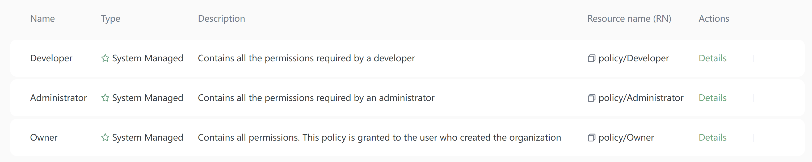
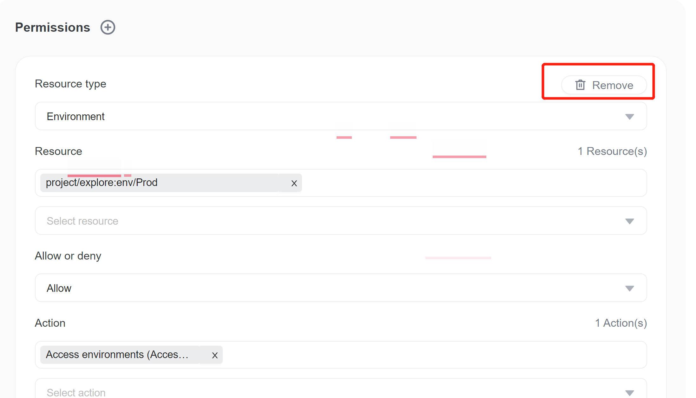
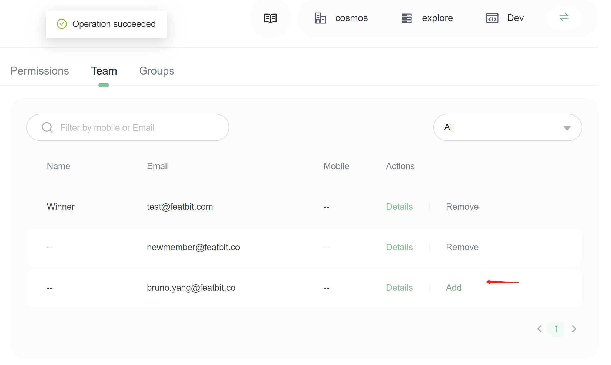
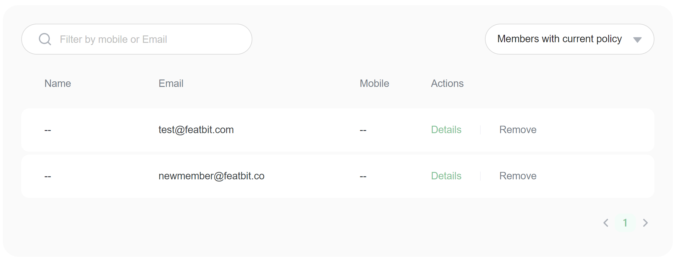
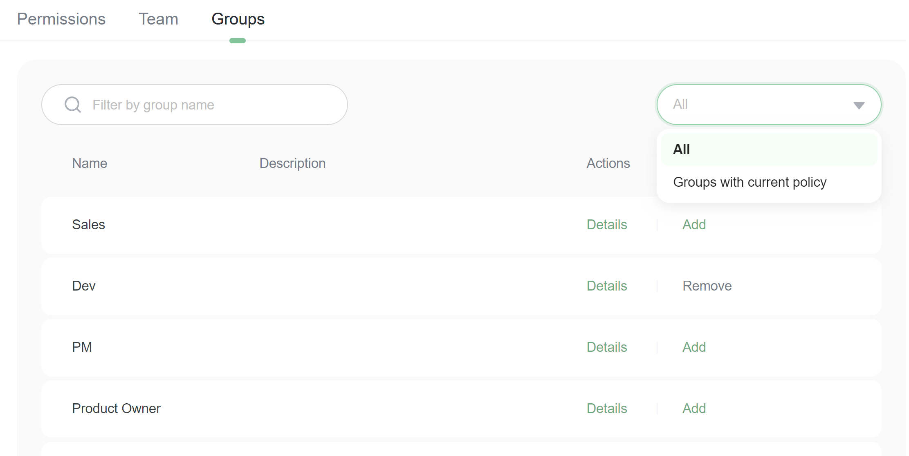
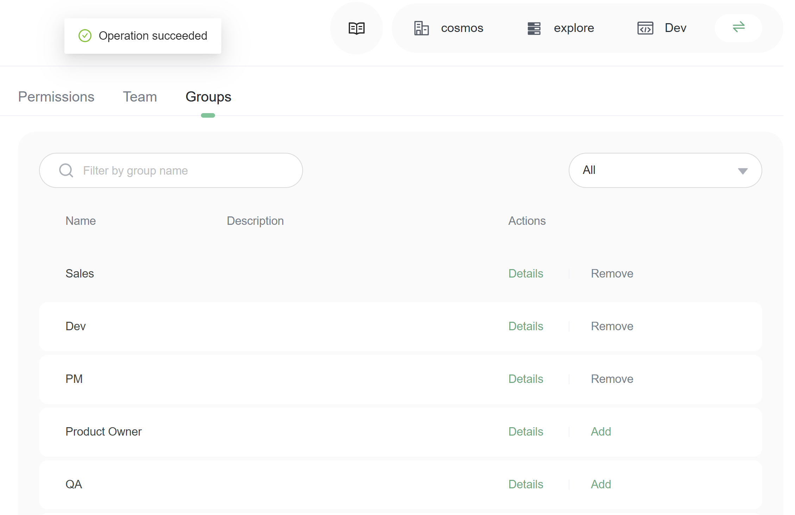

# Policies

You manage access in FeatBit by creating policies and attaching them to IAM identities (users, groups of users) or FeatBit resources. A policy is an object in FeatBit that, when associated with an identity or resource, defines their permissions. FeatBit evaluates these policies when an IAM member makes a request. Permissions in the policies determine whether the request is allowed or denied.

## Control level (Resource types)

FeatBit policy now supports three control levels (also called resource types):

* **All**, which controls if all resources are allowed or denied for members (or group of member).
* **General**, which controls members' access permission of resource-level of Account, IAM and Project
* **Project**, which controls members' access permission of projects.
* **Environment**, which controls members' access permission of all environments.

## Built-in policies

FeatBit provides three built-in policies which can't be modified. If needed, you can make a copy and modify it for your own needs.

## Add a policy

1\. Go to Policy page, click Add button

2\. In the Add policy drawer, input name and description of new policy. Then click **Save** to create.

3\. A new item is added to the policy list. You can filter policies by name to find the policy you just created.

4\. Click on the policy you just created (or click on the **Details** action button). Go to the policy detail page.

## Policy detail page

The policy detail page is composed of 6 parts:

* Name and Description of policy
* Type of policy (generated by the system)
* Resource Name
* Permission list, which can add, update and delete permissions of the policy
* Team, which can assign this policy to members or remove the policy from members
* Groups, which can assign this policy to groups or remove it from groups.

## Add permissions

1\. Click `(+)` icon, a new and empty permission form appears.

2\. Choose the control-level (resource type). If you want to control access permission of environment-level, choose **`Environment`**

3\. Select the resource you want to deny or allow access to.

* In resource selector, we choose project/explore:env/Dev. It means the `product` environment we want to assign access to belongs to project `explore`. You can choose multiple resources, here we choose only one.
* In allow or deny selector, we choose `Allow`
* In action selector, we choose `Access environments`.

4\. Click **Save**. You can create multiple permissions in on policy.

The permission above we created allows members who have this permission to access all resources in `product` environment of project `explore` , but those members can't modify resources.

Each policy can add multiple permissions.

## Remove permission

You can remove permission by clicking on the `Remove` button from permission list.

## Assign permission to members

1\. Go to policy detail page, switch to **Team** tab

2\. Set selector to `All`, you will see all members in the organization

3\. Find the members whom you assign the policy to. Click **Add** button on the member item in the list.

4\. Change the selector from `All` to `Members with current policy`. You will only see the members who have the current policy.

5\. Click the **Remove** button to remove members from the policy.

## Assign permission to groups

1\. Go to policy detail page, switch to **Groups** tab

2\. Set selector to `All`, you will see all groups in the organization

3\. Find the groups that you assign the policy to. Click **Add** button on the group item in the list.

4\. Change the selector from `All` to `Groups with current policy`. You will only see the members who have the current policy.

5\. Click the **Remove** button to remove groups from the policy.

