# Permision Access Control (RBAC)

## Organization Level Access Control

Once you install the FeatBit in your infrastructure, you actually are the owner of a workspace. Each workspace could have multiple organizations. Each organization could have multiple projects. Each project can have multiple environments.

For the access control, we start at the organization level. You can control who can access the organization, projects under the organization, and environments under each project, and also the feature flags under each environment.

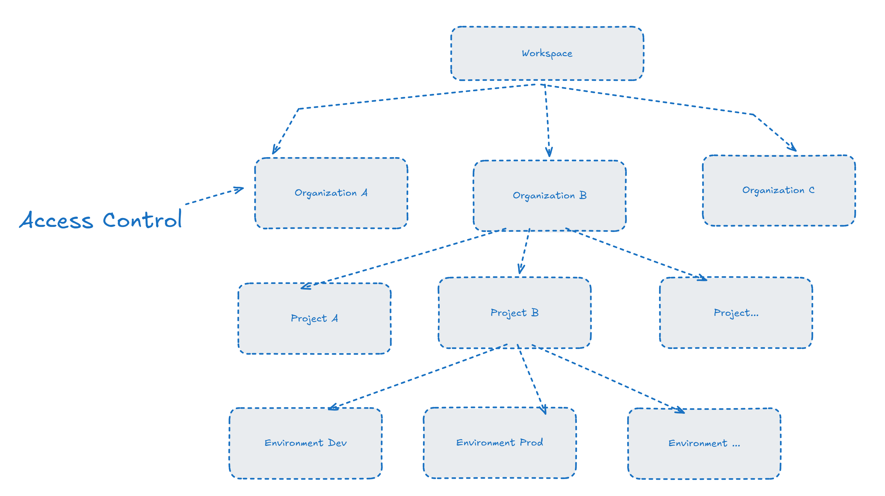

## Prerequisites

Before you start to manage access control, you should:
- Have teams and members created in your organization. You can refer to [User and Team Management](./teams) to add members and teams.
- Have groups (member collections) created in your organization. You can refer to [Group Management](./groups) to add groups.

## Quick Start

You can go section [`Example Walkthrough`](#example-walkthrough) directly to see a complete example of how to manage access control for an organization with multiple projects and multiple teams.

## Project Access Control

After you switch to the organization you want to manage, you will see all projects under this organization as shown below:

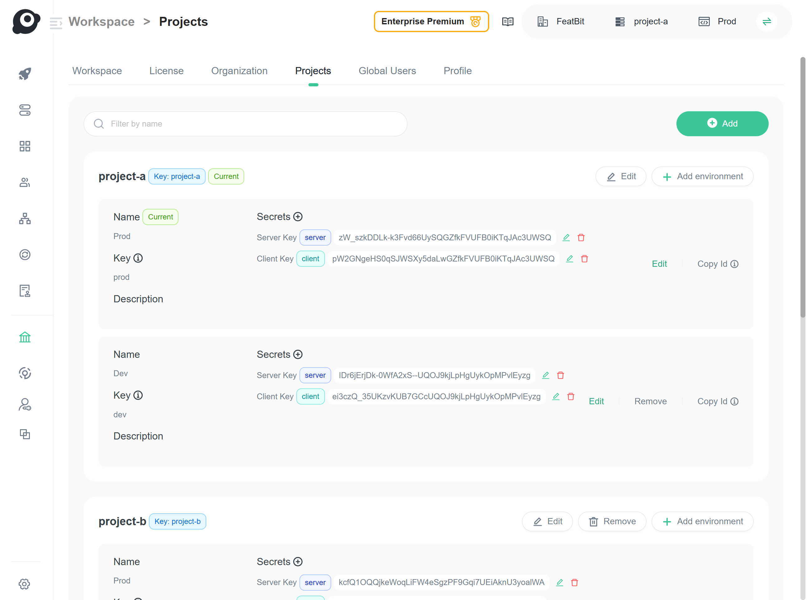

In the next sub-sections, we will show you how to manage access control for projects under this organization.

### Enable User Access to Specific Projects

1. Go to the `Policies` page under `IAM` menu.
2. Click on `Add` button, input the policy name and description, then click `Save`.
3. In the policy detail page, click on `(+)` icon to add a new permission
    - Choose `Project` as the control-level (resource type).
    - Select the project you want to allow access to in resource selector.
    - In allow or deny selector, choose `Allow`.
    - In action selector, choose `CanAccessProject`.

4. Click **Save** to save the permission.
5. Go to `Team` or `Groups` tab to assign this policy to members or groups.

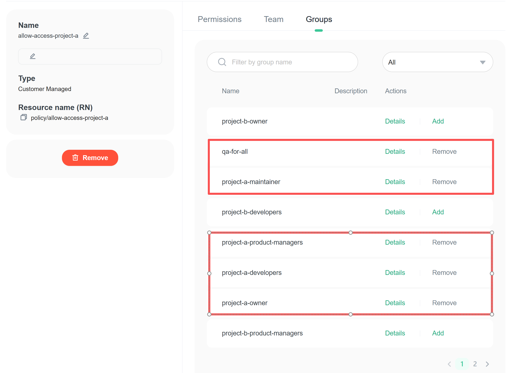

In the picture above, we assign the `policy/allow-access-project-a` policy to all groups that need to access `Project A`.

### Set Project Management Permissions

For groups like `Project Maintainers` and `Project Owner`, they need more permissions to manage the project, such as creating environments, creating feature flags, etc.

1. Go to the `Policies` page under `IAM` menu.
2. Click on `Add` button, input the policy name and description, then click `Save`.
3. In the policy detail page, click on `(+)` icon to add a new permission
    - Choose `Project` as the control-level (resource type).
    - Select the `project/project-a` in resource selector to assign management permissions for `Project A`.
    - In allow or deny selector, choose `Allow`.
    - In action selector, assign all permissions that the group needs. E.g. all permissions for project owner.

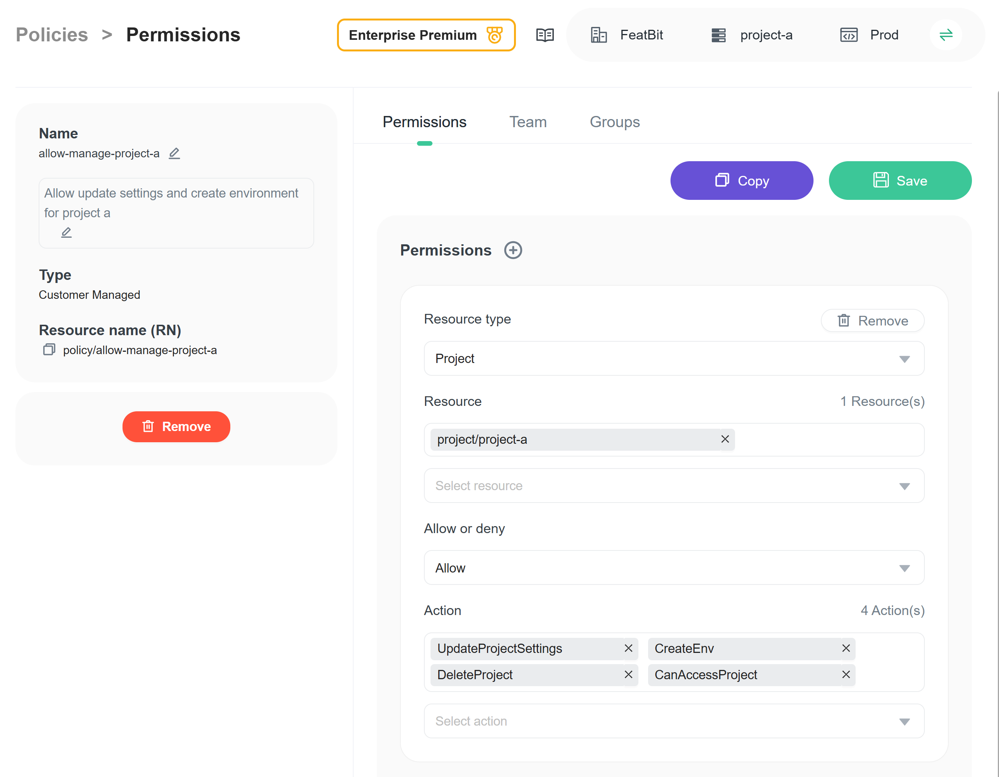

4. Click **Save** to save the permission.
5. Go to `Team` or `Groups` tab to assign this policy to members or groups.

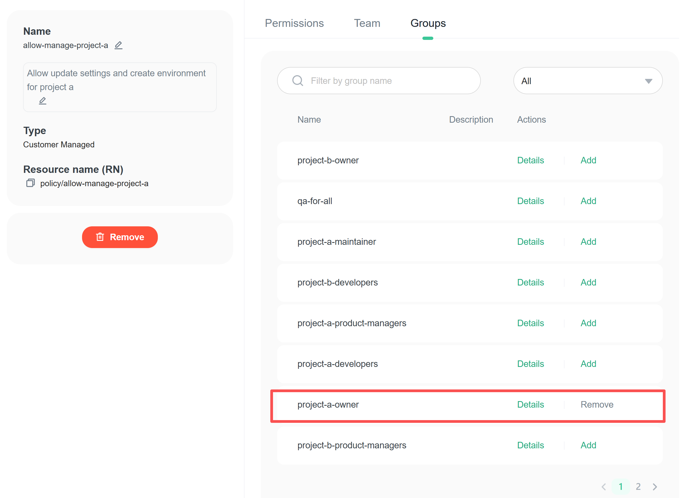

As shown in the picture above, we assign the `policy/project-a-owner-full-permission` policy to `Project A Owner` group. Because only project owner should have full management permissions for the project, such as deleting project.

## Environment Access Control

For each project, you can have multiple environments, such as `development`, `staging`, and `production`. You can also control who can access each environment and what management permissions they have for each environment.

For example, developers of Project A can see all environments under Project A, but they can only create and manage feature flags in the `development` environment. They can only read feature flags in the `production` environment.

### Enable User Access to Specific Environments

1. Go to the `Policies` page under `IAM` menu.
2. Click on `Add` button, input the policy name and description, then click `Save`.
3. In the policy detail page, click on `(+)` icon to add a new permission
4. Add a project access permission first, if not already added:
5. Add an environment access permission:
    - Choose `Environment` as the control-level (resource type).
    - Select the environment you want to allow access to in resource selector.
    - In allow or deny selector, choose `Allow`.
    - In action selector, choose `CanAccessEnvironment`.

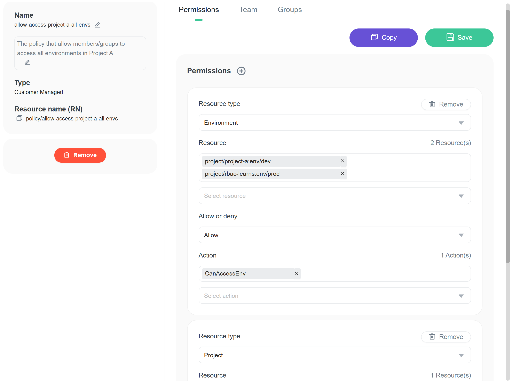

As shown above, we create a policy to allow access to `dev` and `prod` environment in `Project A`.

6. Click **Save** to save the permission.
7. Assign this policy to members or groups in `Team` or `Groups` tab.

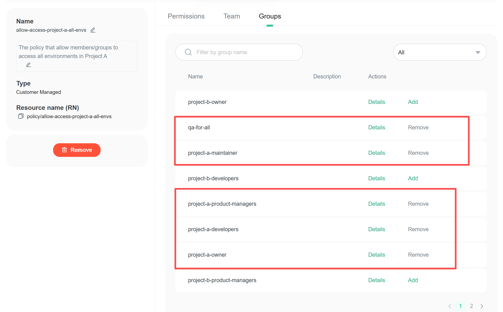

As shown above, we assign the policy to the `Project A Developers` related groups. They should all able to read feature flags in both `dev` and `prod` environments.

### Set Environment Management Permissions

We may assign a environment maintainer roles to allow them to modify environment settings, such as update environment secret. In this case, we need to create a policy to allow them to manage the environment, as image below:

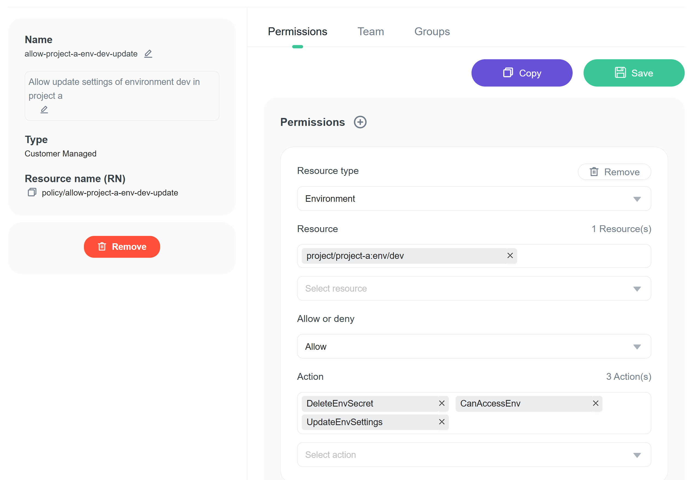

- Select `Environment` as the control-level (resource type).
- Select the specific environment in resource selector.
- In allow or deny selector, choose `Allow`.
- In action selector, choose `DeleteEnvSecret`, `CanAccessEnv` and `UpdateEnvSettings`.
- Save the permission and assign the policy to the related groups.

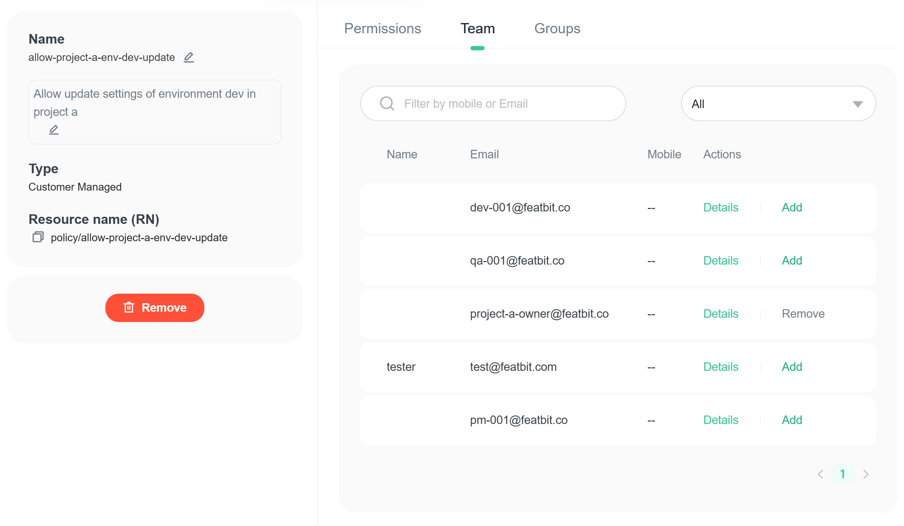

As shown above, we assign the policy to the member `project-a-owner@featbit.com`, who should be able to update environment settings.

## Feature Flag Access Control

Before read or operate a feature flag access control, **make sure the user has access to the project and environment where the feature flag belongs to**.

### Enable User to Operate Feature Flags of Specific Projects/Environments

We will create a policy that includes only permission settings for feature flag in a specific project/environment.

1. Go to the `Policies` page under `IAM` menu.
2. Click on `Add` button, input the policy name and description, then click `Save`.
3. In the policy detail page, click on `(+)` icon to add a new permission
    - Choose `Feature Flag` as the control-level (resource type).
    - Select the project and environment where the feature flag belongs to in resource selector. By default, you can only select all flags of all projects/environments, you need to select it then click on the label to change it to specific project/environment.
    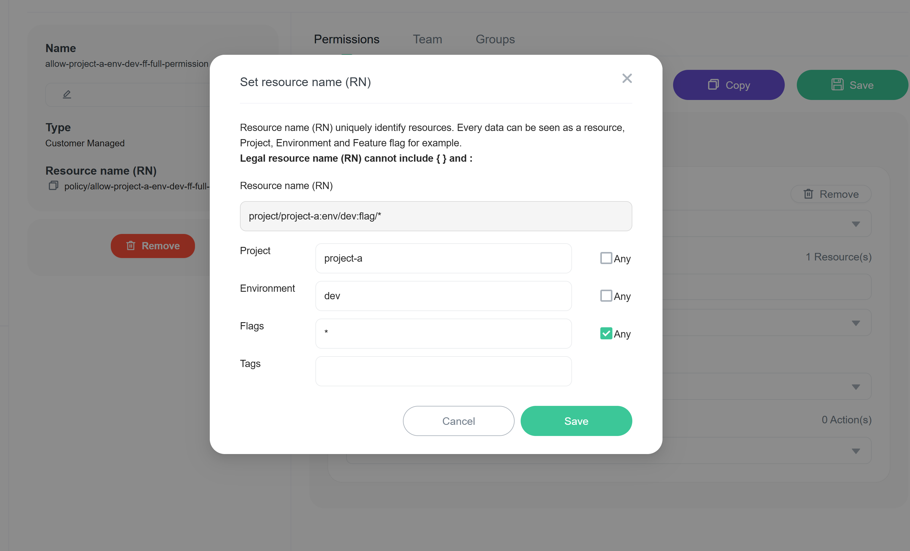
    - In allow or deny selector, choose `Allow`.
    - In action selector, choose all actions.

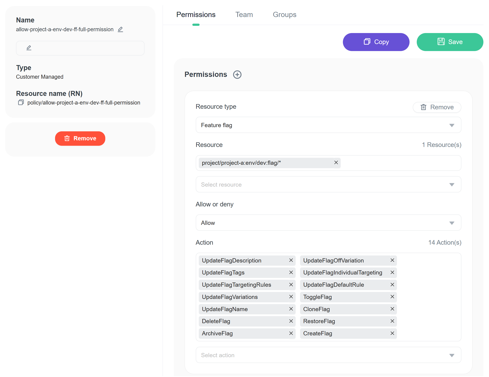

4. Click **Save** to save the permission.
5. Go to `Team` or `Groups` tab to assign this policy to members or groups that need to operate feature flags in the specific project/environment.

### Enable User to Operate a Specific Feature Flag

The only difference between this and the previous section is to set a specific feature flag in resource selector, as shown below:

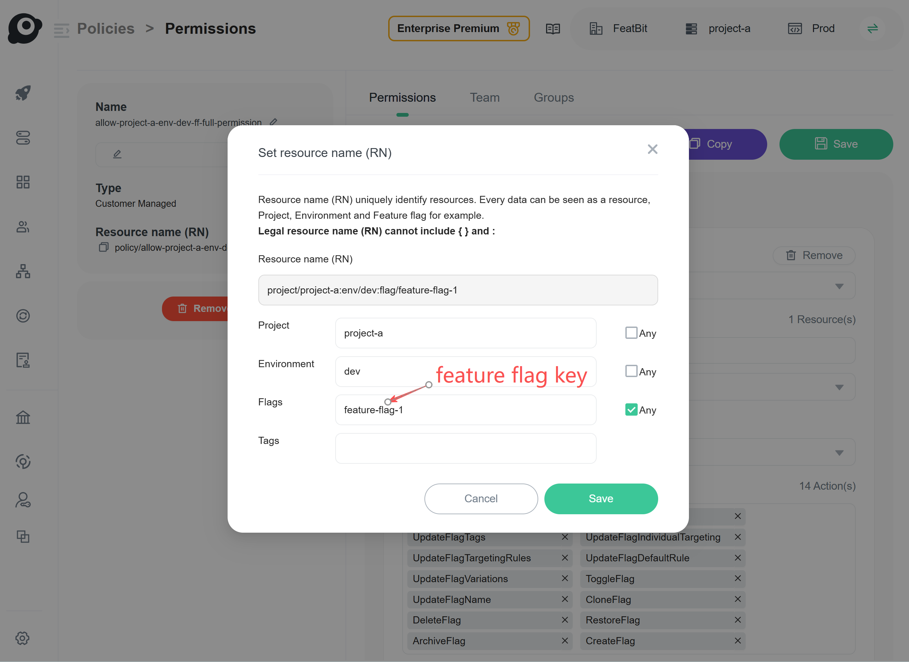

Then save the permission and assign the policy to members or groups.

For multiple feature flags, you need to create multiple permissions, one for each feature flag. Or you can create a `tag` for these feature flags, then set the permission for the tag. As shown below, you can specify the tag name in resource editor popup:

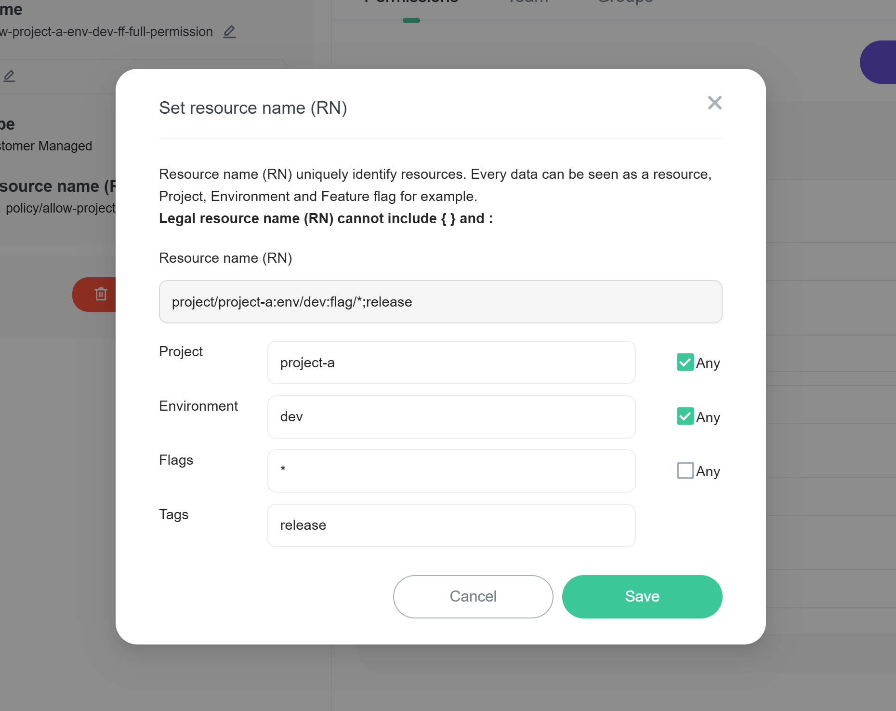

You can add multiple tags by separating them with commas `,`.

### Disable User to Operate a Specific Feature Flag

You may only want to disable user to operate a specific feature flag, while still allow them to operate other feature flags in the same project/environment. In this case, you need to create a deny policy for the specific feature flag.

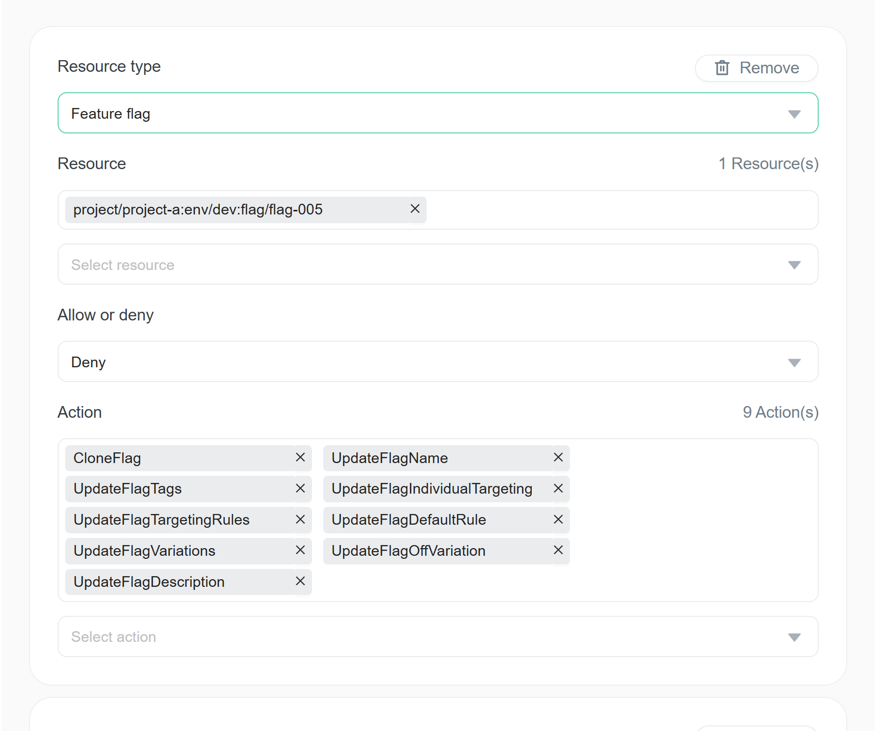

As shown above, we create a deny permission for a specific feature flag. You can select the actions that you want to deny for this feature flag.

Then save the permission and assign the policy to members or groups.

## Example Walkthrough

### Context

Imaging that in an organization, we have multiple projects. We have the following requirements:

- A specifc member that own the `Project A`: Can do everything for `Project A`.
- QAs can access both `Project A` and `Project B`, but they can only view feature flags, not operate them.
- PMs in the group `PM Team A` can do everything for feature flags in `Project A`, except delete feature flags.
- Developers in the group `Dev Team A`:
    - Can do everything for feature flags in `Project A`, `dev` environment.
    - Only view feature flags in `Project A`, `prod` environment, and only allow to operate one specific feature flag.
- External developers in the group `External Devs`:
    - Can only view and operate feature flags in `Project A`, `dev` environment.

### Solution

To achieve the above requirements, we need to create the following policies:
- Policy `Project A Maintainer` to allow full access to Project A (all environments) for given members. [See [Policy `Project A Maintainer`](#policy-project-a-maintainer)].
- Policy `Project A QA` to allow read-only access to Project A (all environments). [See [Policy `Project A QA`](#policy-project-a-qa)].
- Policy `Project A PM` to allow full access to Project A's all feature flags except create and archive action. [See [Policy `Project A PM`](#policy-project-a-pm)].
- Policy `Project A Dev` to allow [See [Policy `Project A Dev`](#policy-project-a-dev)]: 
    - Full access to Project A's feature flags in `dev` environment.
    - Read-only access to Project A's feature flags in `prod` environment.
    - Allow operate a specific feature flag in `prod` environment.
- Policy `Project A External Dev` to allow [See [Policy `Project A External Dev`](#policy-project-a-external-dev)]:
    - Read and operate access to Project A's feature flags in `dev` environment.

### Policy `Project A Maintainer`

1. Create a policy named `Project A Maintainer`. Resource Name (RN) is `policy/policy/Project A Maintainer`.
2. Add a permission for project level access:
    - Control Level: `Project`
    - Resource Selector: `project/project-a`
    - Allow or Deny: `Allow`
    - Actions: all actions for project owner.
3. Add a permission for environment level access:
    - Control Level: `Environment`
    - Resource Selector/Editor: `project/project-a:env/dev*`, `project/project-a:env/prod*`
    - Allow or Deny: `Allow`
    - Actions: `CanAccessEnv`
4. Add a permission for feature-flag level access:
    - Control Level: `Feature Flag`
    - Resource Selector/Editor: `project/project-a:env/*:flag/*`
        - Project: `project-a`
        - Environment: `*`
        - Feature Flag: `*`
    - Allow or Deny: `Allow`
    - Actions: all actions for feature flags.

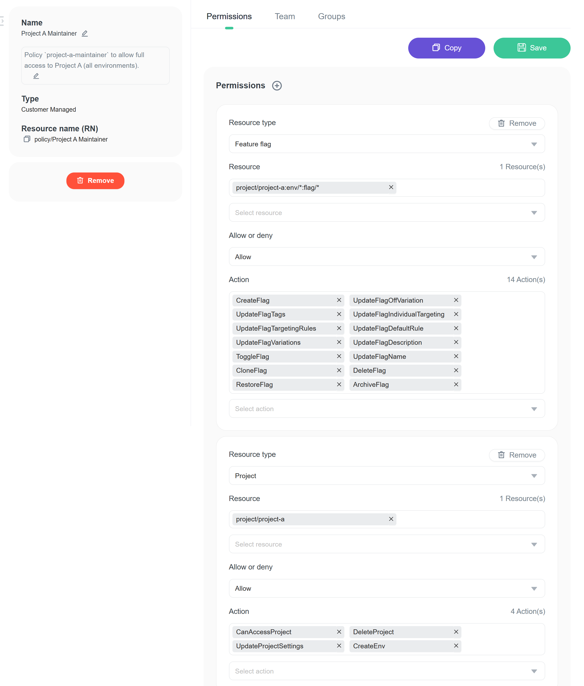

4. Save the policy and assign it to member `project-a-owner@featbit.co`

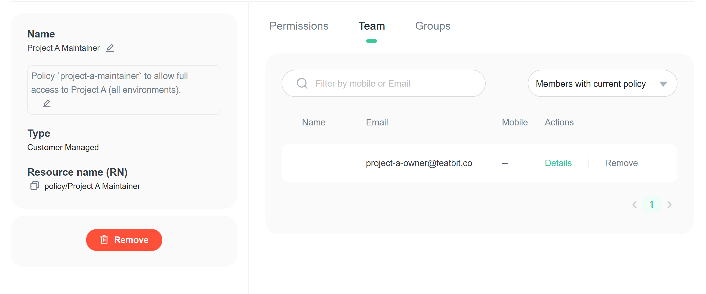

NOTE: Be sure that the member has removed their default policy assignments, otherwise they may still have more permissions than expected.

### Policy `Project A QA`

1. Create a policy named `Project A QA`. Resource Name (RN) is `policy/policy/Project A QA`.
2. Add a permission for project level access:
    - Control Level: `Project`
    - Resource Selector: `project/project-a`
    - Allow or Deny: `Allow`
    - Actions: `CanAccessProject`
3. Add a permission for environment level access:
    - Control Level: `Environment`
    - Resource Selector/Editor: `project/project-a:env/dev*`, `project/project-a:env/prod*`
    - Allow or Deny: `Allow`
    - Actions: `CanAccessEnv`

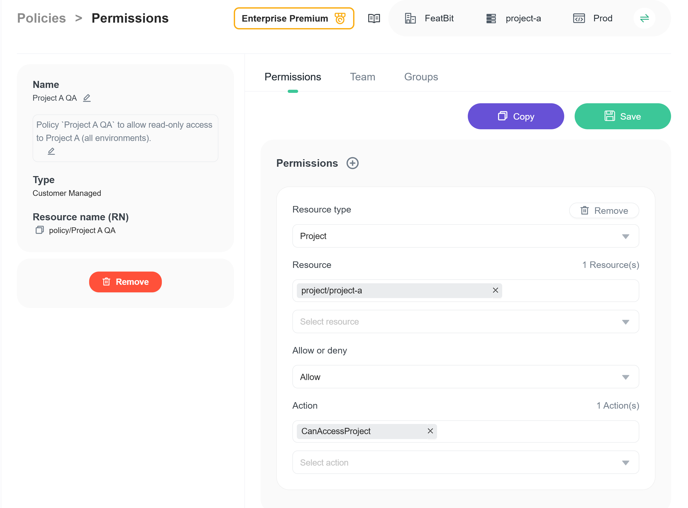

4. Save the policy and assign it to group `Project A QAs`.

NOTE: Be sure that all members in QA groups have removed their default policy assignments, otherwise they may still have more permissions than expected.

### Policy `Project A PM`

1. Create a policy named `Project A PM`. Resource Name (RN) is `policy/policy/Project A PM`.
2. Add a permission for project level access:
    - Control Level: `Project`
    - Resource Selector: `project/project-a`
    - Allow or Deny: `Allow`
    - Actions: `CanAccessProject`
3. Add a permission for feature-flag level access:
    - Control Level: `Feature Flag`
    - Resource Selector/Editor: `project/project-a:env/*:flag/*`
        - Project: `project-a`
        - Environment: `*`
        - Feature Flag: `*`
    - Allow or Deny: `Allow`
    - Actions: all actions except `CreateFlag`, `ArchiveFlag` and `DeleteFlag`.

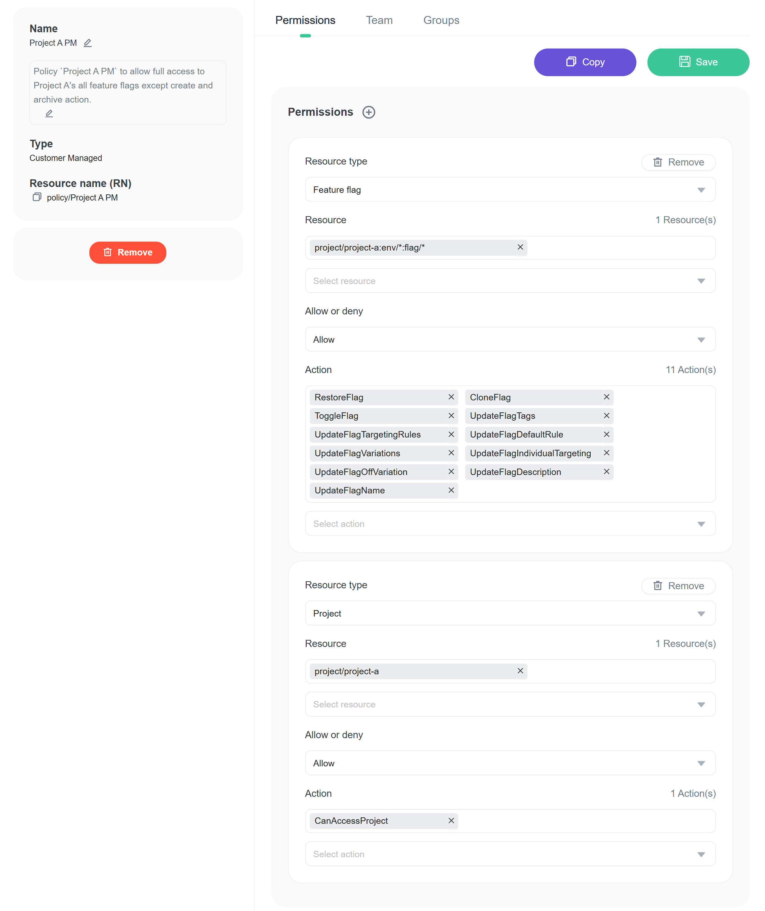

4. Save the policy and assign it to group `Project A PMs`.
5. Assign the policy to all members in the group `Project A PMs`.

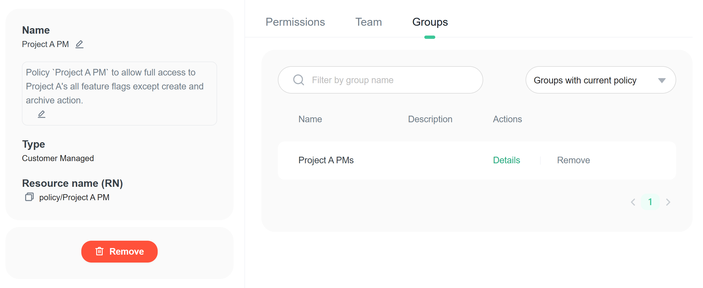

NOTE: Be sure that all members in `Project A PMs` groups have removed their default policy assignments, otherwise they may still have more permissions than expected.

### Policy `Project A Dev`

1. Create a policy named `Project A Dev`. Resource Name (RN) is `policy/Project A Dev`.
2. Add a permission for project level access:
    - Control Level: `Project`
    - Resource Selector: `project/project-a`
    - Allow or Deny: `Allow`
    - Actions: `CanAccessProject`
3. Add a permission for feature-flag level access in `dev` environment:
    - Control Level: `Feature Flag`
    - Resource Selector/Editor: `project/project-a:env/dev:flag/*`
        - Project: `project-a`
        - Environment: `dev`
        - Feature Flag: `*`
    - Allow or Deny: `Allow`
    - Actions: all actions for feature flags.
4. Add a permission for specific feature-flag in `prod` environment:
    - Control Level: `Feature Flag`
    - Resource Selector/Editor: `project/project-a:env/prod:flag/*`
        - Project: `project-a`
        - Environment: `prod`
        - Feature Flag: `a-specific-flag-for-dev`
    - Allow or Deny: `Allow`
    - Actions: `UpdateFlagTags`, `UpdateFlagDefaultRule`, `UpdateFlagIndividualTargeting`, `UpdateFlagTargetingRules`

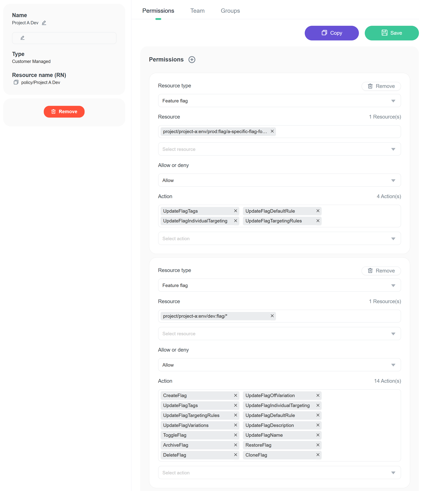

5. Save the policy and assign it to group `Project A Devs`.

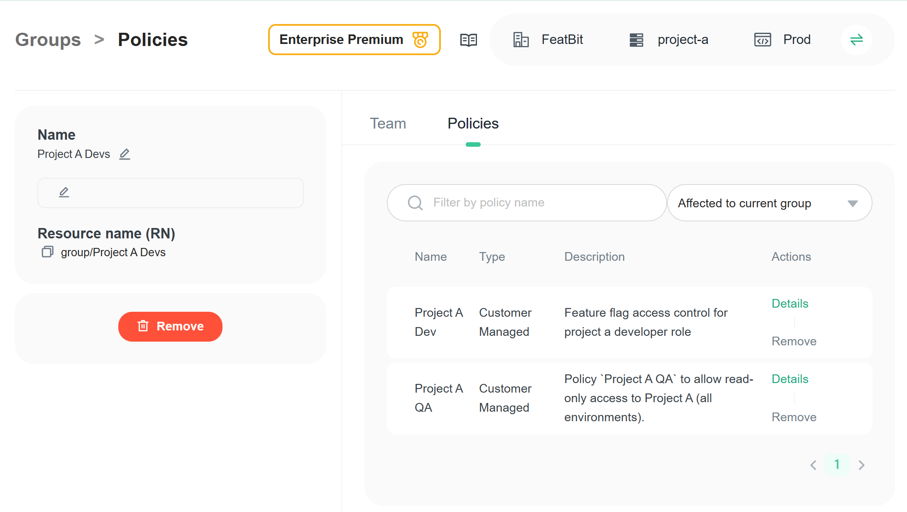

Note: Be sure that all members in `Project A Devs` groups have removed their default policy assignments, otherwise they may still have more permissions than expected.

### Policy `Project A External Dev`

1. Create a policy named `Project A External Dev`. Resource Name (RN) is `policy/Project A External Dev`.
2. Add a permission for project level access:
    - Control Level: `Project`
    - Resource Selector: `project/project-a`
    - Allow or Deny: `Allow`
    - Actions: `CanAccessProject`
3. Add a permission for environment level access in `prod` environment:
    - Control Level: `Environment`
    - Resource Selector/Editor: `project/project-a:env/prod`
    - Allow or Deny: `Deny`
    - Actions: `CanAccessEnv`
4. Add a permission for feature-flag level access in `dev` environment:
    - Control Level: `Feature Flag`
    - Resource Selector/Editor: `project/project-a:env/dev:flag/*`
        - Project: `project-a`
        - Environment: `dev`
        - Feature Flag: `*`
    - Allow or Deny: `Allow`
    - Actions: all actions for feature flags.

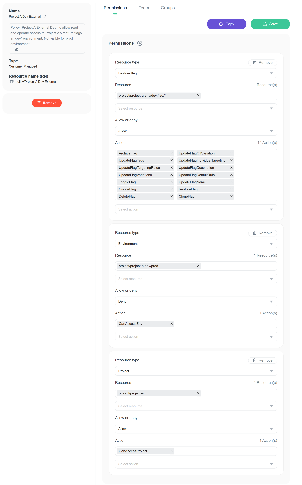

5. Save the policy and assign it to group `External Devs`.

### Conclusion

By following the above steps, we have successfully created and assigned policies to meet the access control requirements for `Project A` in our organization. Each group and member now has the appropriate permissions to access and manage feature flags according to their roles.

Please remember to regularly review and update the policies as needed to ensure that they continue to meet the evolving needs of your organization.

For any unexpected behaviors or issues, please join our [slack community](https://featbit.com/community) or contact us by email at [contact@featbit.co](mailto:contact@featbit.co)