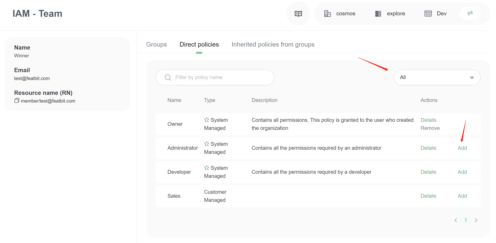
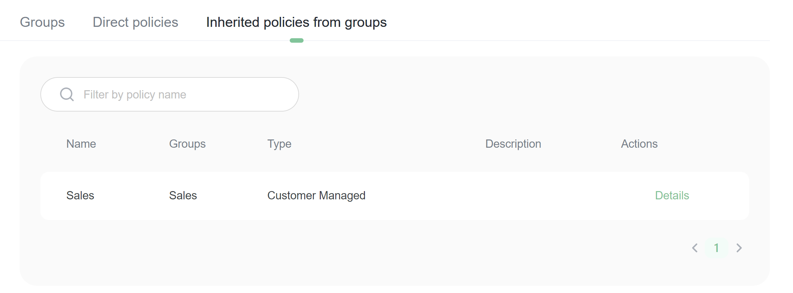

# Teams

## Overview

This topic explains how to manage team members, team maintainers, and team permissions in FeatBit (an [open source feature flags](https://www.featbit.co/blogs/Free-and-Open-Source-Feature-Flag-Tools) service).

## Managing members in default Team

At the moment, FeatBit provides only one default team. You can create, update, delete and manage members on the team page in the IAM section.

### Adding a member to the team

1. Navigate to the Team page in the IAM section.
2. Click **Add** button. The "Add team member" dialog appears.
3. Enter the email of the member.
4. Choose the initial permission of the member.
5. Choose the initial group (it can be empty).
6. Click **Add** button to create a new member.

The new member was created with an initial password. It would be best if you paste it to your colleague.

### Delete a member from the team

You can remove a member from **IAM - Team** page. Click the **Remove** button of the member/user you want to delete from the list. Member/User won't be able to log in if it's not in the team list.

### Update member information

Only members him/her-self can modify his/her information, it includes email and name. Members can change their information on the Profile page.

### Member list

You can filter members by email.

## Assign permission policies to a member

Permissions are managed on the Policy page. You can configure member's policies on the **Direct policies** tab on the member detail page.

1. Change selector to option **All**
2. Click **Add** button on the policy you want to assign.
3. Switch selector option to **Assigned to current member**
4. You will only see the policies assigned to the current team member.
5. You can click **Remove** to detach the policy from the team memebr.

If a member is sent to a group, this user will also inherit the policies from this group.

## Assign a member to a group

You can give member one or multiple groups, this member will inherit all permision policies of these groups. You can configure member's groups on the **Groups** tab on the member detail page.

* Change selector to option **All**
* Click **Add** button on the group you want to assign.
* Switch selector option to **Containing current member**
* You will only see the group assigned to the current user(member).
* You can click **Remove** to detach the group from the user(memebr).

