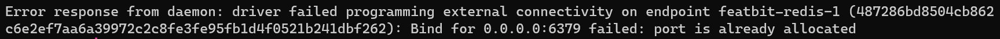

# FAQ

### How to solve docker container port conflict problem

**Q:** How to solve the docker container port conflict problem when I run `docker compose up -d`?

**A:** You just need to change the container port in docker-compose.yml.

For example, if you already have a Redis container using the host machine's port 6379, when you try to launch our system with `docker-compose up -d`, you can see the port conflict error from docker daemon like this



To solve this problem, go to **docker-compose.yml**, find the Redis service and change it's binding port to something other than 6379.

```yaml
# redis service
redis:
  image: bitnami/redis:6.2.7
  container_name: redis
  restart: on-failure
  environment:
    - ALLOW_EMPTY_PASSWORD=yes
  networks:
    - featbit-network
  ports:
    # change the binding port to 6380
    - "6380:6379"
  volumes:
    - redis:/data
```

### How to make FeatBit portal accessible publicly

With the default configuration, the FeatBit's portal is only accessible from the local machine on which you ran docker compose.

To make the UI accessible from other machines or even from the internet, you need a public IP or domain name for the machine on which it is running. Additionally, if the API and Evaluation services are running on different machines than the UI service, you may also need public IP addresses or domain names for them. Then, set the correct values for **API\_URL** and **EVALUATION\_URL** in the docker-compose file. Please check our architecture doc of [standard version](../tech-stack/architecture) and [pro version](../tech-stack/architecture-professional) for a detail explanation of all the services of FeatBit.

```yaml
# docker-compose.yml
ui:
  image: featbit/featbit-ui:latest
  container_name: ui
  environment:
    # example: 192.168.56.1:5000
    - API_URL=http://[REPLACE_WITH_THE_API_SERVER_IP_OR_DOMAIN]
    # keep it like this, this is for tutorial
    - DEMO_URL=https://featbit-samples.vercel.app
    # example: 192.168.56.1:5100
    - EVALUATION_URL=http://[REPLACE_WITH_THE_EVALUATION_SERVER_IP_OR_DOMAIN]
  depends_on:
    - api-docs-server
  ports:
    - "8081:80"
  networks:
    - featbit-network
```

### Use FeatBit with Azure Cosmos DB

Cosmos DB always requires an index for the fields being sorted. To use FeatBit with Cosmos DB, you need to create these indexes manually. Below is the script for creating them:

```javascript
const createdAtCollections = ["RelayProxies", "Projects", "AccessTokens", "Policies", "AuditLogs"];
createdAtCollections.forEach(collection => {
    db.getCollection(collection).createIndex(
        { "createdAt": -1 },
        { background: true }
    );
});
const updatedAtCollections = ["EndUsers", "FeatureFlags", "Segments"]
updatedAtCollections.forEach(collection => {
    db.getCollection(collection).createIndex(
        { "updatedAt": -1 },
        { background: true }
    );
});
```

#### Reference

* [https://learn.microsoft.com/en-us/azure/cosmos-db/mongodb/error-codes-solutions](https://learn.microsoft.com/en-us/azure/cosmos-db/mongodb/error-codes-solutions)
* [https://www.mongodb.com/community/forums/t/sort-in-cosmosdb-mongo-apis-mandates-indexing/115529](https://www.mongodb.com/community/forums/t/sort-in-cosmosdb-mongo-apis-mandates-indexing/115529)

