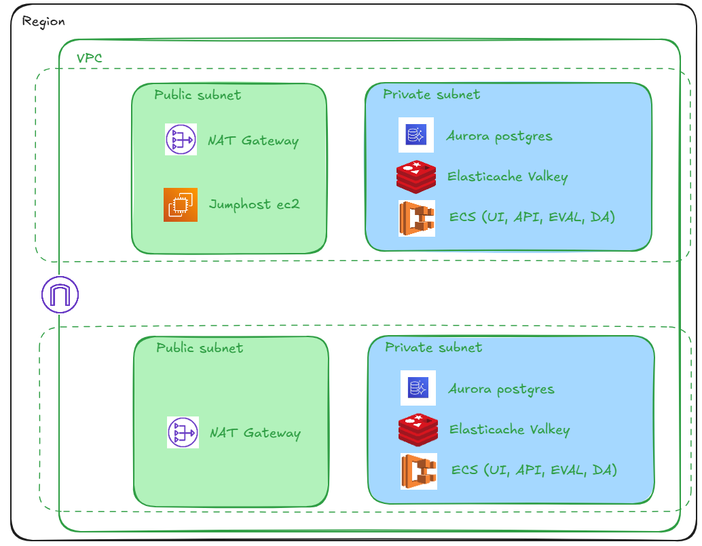

## Installation

You can deploy FeatBit to AWS with terraform. For how to deploy FeatBit to AWS, 
please refer to the [featbit-terraform-aws](https://github.com/featbit/featbit-terraform-aws) reposity.

The following image illustrate the general infrastructure

