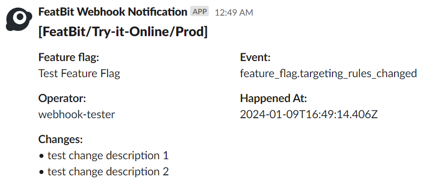

# Slack

We can send flag or segment change events from FeatBit into your Slack channels by using the [Slack Sending Messages Api](https://api.slack.com/messaging/sending#publishing).

## Pre-requisites

1. [Set up a Slack App](https://api.slack.com/messaging/sending#getting_started)
2. [Create a FeatBit Webhook](../webhooks#creating-a-webhook)

## Preview

Here is an example of what the message will look like in your Slack channel.



## Message Template

You can use the following webhook payload template to send a message to your Slack channel. Be sure to replace `YOUR_CHANNEL_ID` with the id of the channel you want to send the message to.

```handlebars
{
   "channel":"YOUR_CHANNEL_ID",
   "blocks":[
      {
         "type":"header",
         "text":{
            "type":"plain_text",
            "text":"[{{organization.name}}/{{project.name}}/{{environment.name}}]"
         }
      },
      {
         "type":"section",
         "fields":[
            {
               "type":"mrkdwn",
               "text":"*{{#eq data.kind "feature flag"}}Feature flag{{/eq}}{{#eq data.kind "segment"}}Segment{{/eq}}:*\n{{data.object.name}}"
            },
            {
               "type":"mrkdwn",
               "text":"*Event:*\n{{events}}"
            }
         ]
      },
      {
         "type":"section",
         "fields":[
            {
               "type":"mrkdwn",
               "text":"*Operator:*\n{{operator}}"
            },
            {
               "type":"mrkdwn",
               "text":"*Happened At:*\n{{happenedAt}}"
            }
         ]
      },
      {
         "type":"section",
         "fields":[
            {
               "type":"mrkdwn",
               "text":"*Changes:*\n{{#each changes}}• {{this}}{{#unless @last}}\n{{/unless}}{{/each}}"
            }
         ]
      }
   ]
}
```