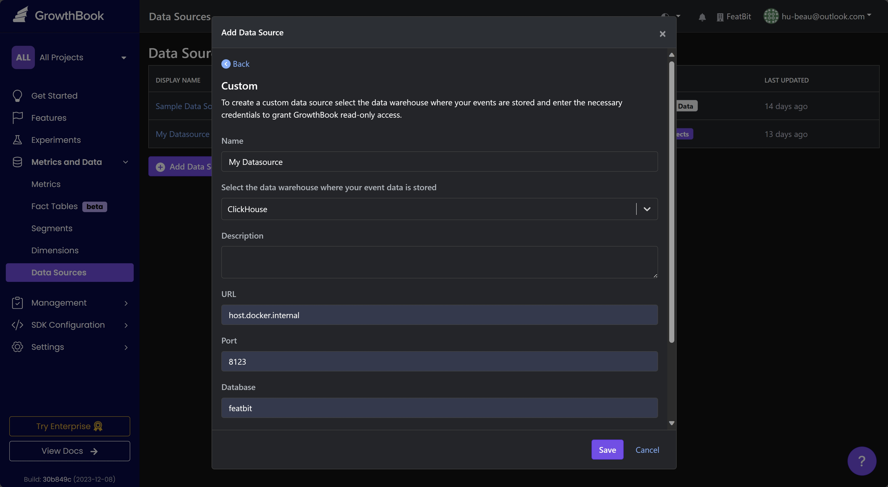
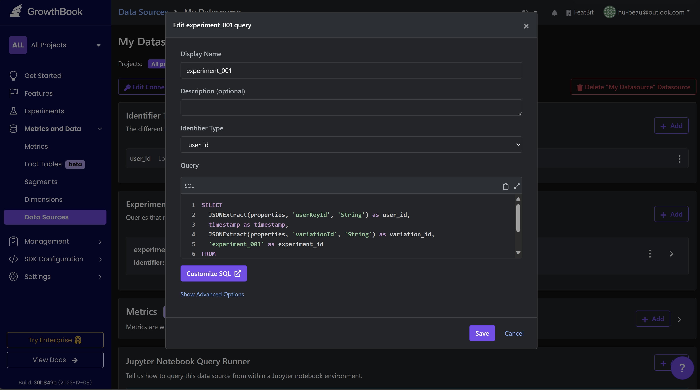
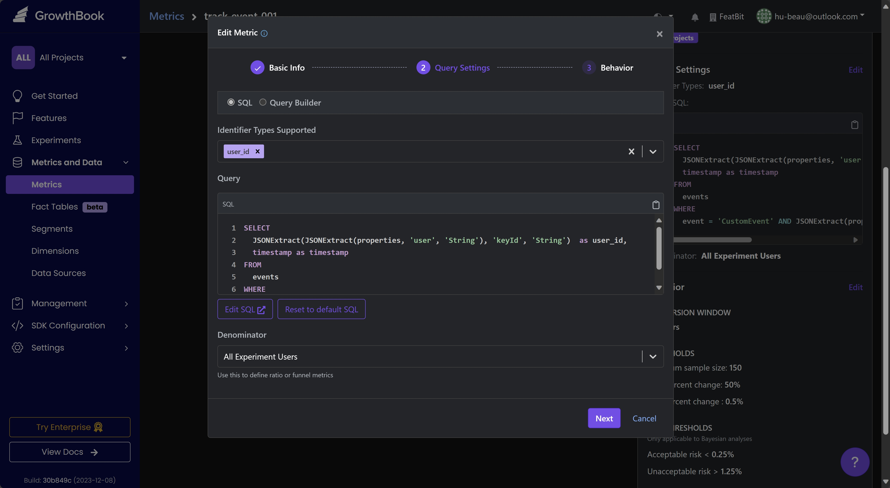
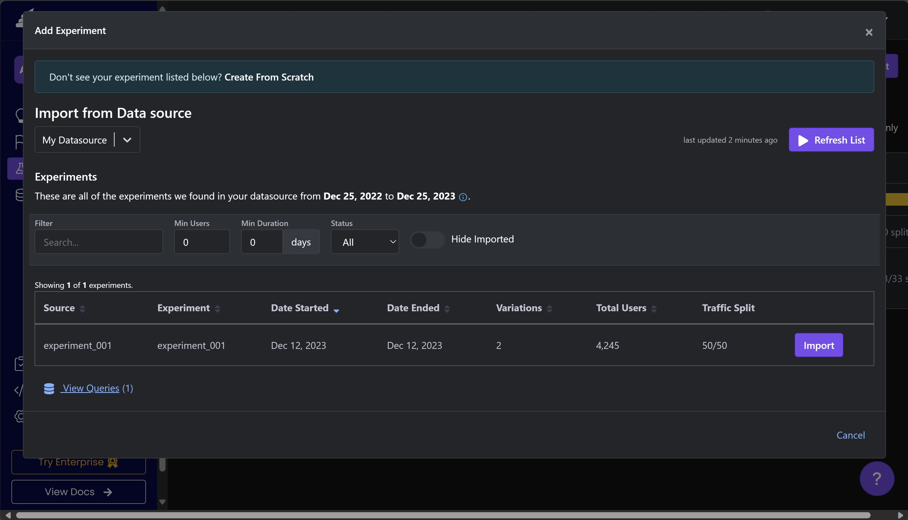
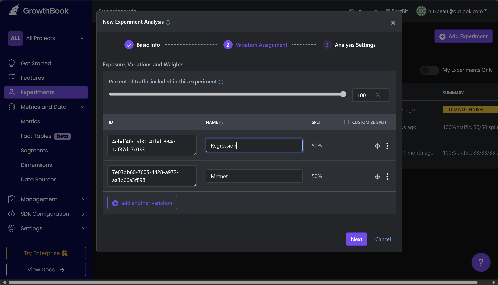
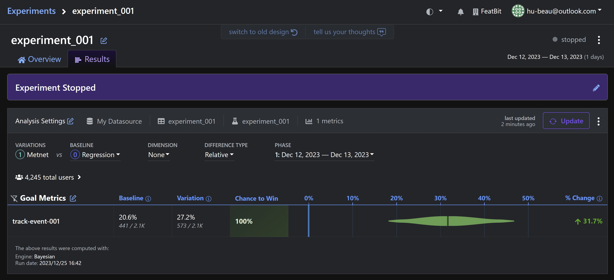

import { Callout } from 'nextra/components'

# Growthbook

You can use Growthbook to connect our ClickHouse to run AB Testings.

## Connect to FeatBit Data Source

FeatBit uses ClickHouse as the data store for its Pro version. In Growthbook, you can connect to it using the following settings:



## Add Experiment Assignment Queries

Go to your data source page and, in the 'Experiment Assignment Queries' section, click the **+ Add** button.

In the 'Edit XXX Query' popup window, enter the following SQL query:

```sql
SELECT
  JSONExtract(properties, 'userKeyId', 'String') as user_id,
  timestamp as timestamp,
  JSONExtract(properties, 'variationId', 'String') as variation_id,
  'experiment_001' as experiment_id
FROM
  events
WHERE
  event = 'FlagValue' AND JSONExtract(properties, 'sendToExperiment', 'Bool') = true
```

> In this query you will get FeatBit's feature flag usage data (you can also call it Feature Flag Expriment Assignment data) from ClickHouse. For more information about the data, please follow [Data Export Doc](/data-import-and-export/data-export).

Then click the **Save** button.




## Add Metrics

On the data source page, in the 'Metrics' section, click the **+ Add** button.

In the 'New Metric' popup window, enter the **Metric Name**, and choose your **Metric Type**.

Select **SQL**, then enter the **Query** using the following SQL query:

```sql
SELECT
  JSONExtract(JSONExtract(properties, 'user', 'String'), 'keyId', 'String')  as user_id,
  timestamp as timestamp
FROM
  events
WHERE
  event = 'CustomEvent' AND JSONExtract(properties, 'eventName', 'String') = '{custom event name}'
```

> In this query you will get FeatBit's Experiment events data (you can also call it Metric data) from ClickHouse. For more information about the data, please follow [Data Export Doc](/data-import-and-export/data-export).



Then click the **Save** button.

## Create Experiment

On the 'Experiments' page, click the **+ Add Experiment** button then choose **Analyze an Existing Experiment**.

Select the Data Source you created earlier. Growthbook will then automatically load the experiment assignment queries and metrics you have previously set up. Click the **Import** button.



Follow the guide in the 'New Experiment Analysis' popup window. Choose your  **Experiment Assignment Table** and **Goal metric**, then click the **Save** button.



After this, you can view your experiment. In the 'Results' panel, click the **Update** button. You will then see the experiment report as shown above.


