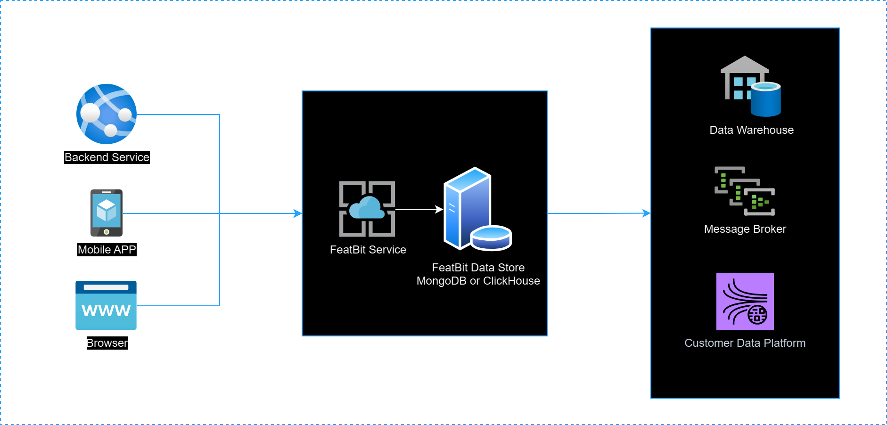

import {Callout} from 'nextra/components'

## Overview

This section describes a temporary method for exporting feature flag usage data and experiment events to your preferred data store or warehouse. This allows you to analyze the data using your own tools and systems.



As the diagram above shows, the current process involves extracting data from FeatBit's ClickHouse database (or MongoDB for the standard version) and then transferring it to a third-party or your own Custom Data Platform, Message Brokers, Data Warehouse, etc.

> We refer to this as the '**temporary method**' because it's an interim measure while we better understand the specific needs and best practices of each customer. We invite you to [join our Slack](https://join.slack.com/t/featbit/shared_invite/zt-1ew5e2vbb-x6Apan1xZOaYMnFzqZkGNQ) channel for further discussion on this topic, or you can email us at `contact@featbit.co` for more information.

## Extract Data From ClickHouse

## Send Data To Segment

## Send Data To Azure Event Hub

## Export Data To GrowthBook

Growthbook is an AB Testing tool that allows you to use your own data warehouse to run experiments. It's a great tool for companies that want to own their own data and run experiments on it.

Growthbook support ClickHouse as its data source. You can use the following SQL to create the tables needed for Growthbook to work with Featbit.

```sql
```

## Feedback

If you want us to support other data warehouse, data analytic tools, etc, please let us know by sending us email or join our slack. We appreciate any practice suggestions that may help you.