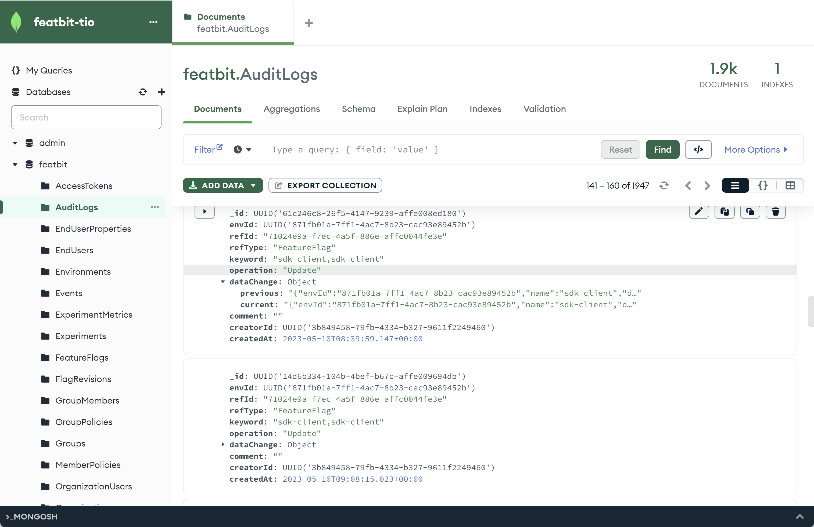

import { Callout } from 'nextra/components'

# DataDog (Preview)

FeatBit offers the following ways to integrate with DataDog:

1. [Using the Datadog RUM integration](https://docs.datadoghq.com/real_user_monitoring/guide/setup-feature-flag-data-collection/?tab=browser#analyze-your-feature-flag-performance-in-rum) to send feature flag evaluation data to DataDog.
2. [Using the Datadog events integration](https://docs.datadoghq.com/api/?lang=bash#events) to receive activities from FeatBit such as Feature Flags updates.
3. [Using flag triggers with Datadog]() to toggle a flag's targeting on or off if a performance metric drops below a certain threshold using FeatBit's flag trigger or REST APIs.
4. Send feature flag usage events and custom events to DataDog Metrics and Traces.

## Using the Datadog RUM integration

[Feature Flag Tracking](https://docs.datadoghq.com/real_user_monitoring/feature_flag_tracking/) gives you greater visibility into your user experience and performance monitoring by allowing you to determine which users are being shown a specific feature and if any change you introduce is impacting your user experience or negatively affecting performance.

### Setup feature flag data collection

To get started, you'll need to [setup DataDog feature flag data collection](https://docs.datadoghq.com/real_user_monitoring/guide/setup-feature-flag-data-collection). For **javascript/typescript** project, you need to initialize the RUM SDK and configure the `enableExperimentalFeatures` initialization parameter with `["feature_flags"]`. This will enable the feature flag tracking feature and send feature flag evaluation data to DataDog.

```javascript
datadogRum.init({
  applicationId: "sample-application-id",
  clientToken: "sample-client-token",
  site: "datadoghq.com",
  service: "demo-app",
  env: "dev",
  version: "1.0.0",
  sessionSampleRate: 100,
  sessionReplaySampleRate: 100,
  trackUserInteractions: true,
  trackResources: true,
  trackLongTasks: true,
  defaultPrivacyLevel: "mask-user-input",
  // This enables the beta feature flag tracking
  enableExperimentalFeatures: ["feature_flags"],
});

datadogRum.startSessionReplayRecording();
```

Then, you can use the `addFeatureFlagEvaluation` method built in to the datadogRum package when evaluating `FeatBit` Feature Flags.

```javascript
import { datadogRum } from "@datadog/browser-rum";
import fbClient from "featbit-js-client-sdk";

const flagEvalResult = fbClient.variation("feature-flag-key", flagsDefaultValues[prop] || '')
datadogRum.addFeatureFlagEvaluation("feature-flag-key", flagEvalResult);
```

If you don't want to write two lines of code everywhere, you can encapsulate the `.variation(...)` and `.addFeatureFlagEvaluation(...)` into a function. In our [React sample](https://github.com/featbit/featbit-samples/blob/main/samples/dino-game/interactive-demo-react/src/featBit/featBitSlice.js) and [Vue sample](https://github.com/featbit/featbit-samples/blob/main/samples/dino-game/interactive-demo-vue/src/featbit.js) projects, we create a `Flags Proxy` to provide a unified interface for getting feature flag values. So you can add the addFeatureFlagEvaluation to the Flags Proxy and use it like this:

```javascript
import { datadogRum } from "@datadog/browser-rum";
import fbClient from "featbit-js-client-sdk";

export const createFlagsProxy = () => {
    return new Proxy({}, {
        get(target, prop, receiver) {
          let returnValue = ''
          if(typeof prop === 'string' && !prop.startsWith('__v_')){
            returnValue = fbClient.variation(prop, flagsDefaultValues[prop] || '');
            datadogRum.addFeatureFlagEvaluation(prop, returnValue);
          }
          return returnValue;
        }
    })
}
```

So when you call feature flag in your code, it will automatically sends feature flag evaluation data to DataDog, as shown in the following code:

```javascript
// Vue example with Pinia, code below also guarantees the real-time update of the feature flag value
<DinoGameCore v-if="featBitStore.flags['game-runner']== true" 
              :difficulty="featBitStore.flags['difficulty-mode']" />

// React example with Redux, code below also guarantees the real-time update of the feature flag value
featureFlags["game-runner"] == true ? 
  <DinoGameCore difficulty={featureFlags["difficulty-mode"]} /> : <>

```


<Callout type="info">
**NOTE**: The tutorial above showed how to collect feature flag evaluation data in the browser. For other platforms such as iOS and Android, please refer to the [DataDog documentation](https://docs.datadoghq.com/real_user_monitoring/guide/setup-feature-flag-data-collection/?tab=ios#custom-feature-flag-management).
</Callout>

<Callout type="info">
**NOTE**: If you are using [DataDog APM](https://www.datadoghq.com/product/apm/), DataDog provides a method to connect your front-end feature flag data to your traces. See [Connect Rum and Traces](https://docs.datadoghq.com/real_user_monitoring/connect_rum_and_traces/?tab=browserrum). This way you can have alerts based on both front-end and back-end errors.
</Callout>

### Analyze your Feature Flag performance in RUM

## Using the Datadog events integration

The Datadog integration lets you set up [Datadog Events](https://docs.datadoghq.com/api) to receive any activity from FeatBit. When something changes, such as a feature flag updates or a new account member is added to FeatBit, FeatBit sends an event to Datadog. Use this integration to correlate and understand how changes to your features in FeatBit impact your app and infrastructure metrics.

Full event integration is still in the works. But you can currently write your own program to monitor the event changes in our MongoDB `AuditLogs` collection. Here's an official tutorial of how to [monitor the collection changes in .NET](https://mongodb.github.io/mongo-csharp-driver/2.7/reference/driver/change_streams/).



Then you can use the [DataDog Events API](https://docs.datadoghq.com/api/latest/events/#post-an-event) to send the activities to DataDog. 

<Callout type="info" emoji='💡'>
Please let us know if you would like us to accelerate feature development for this implementation.
</Callout>


## Using flag triggers with Datadog


<Callout type="info" emoji='💡'>
You can also use [FeatBit REST API](../api-docs/using-featbit-rest-api) endpoint to toggle status of a feature flag.
</Callout>

## DataDog Metrics and Traces

Datadog provides various tools and features for monitoring the performance and behavior of applications and systems. In Datadog, metrics and traces serve different purposes and are used for distinct types of monitoring and analysis. **Metrics** in Datadog are used for high-level, real-time monitoring of performance data like request rates, error rates, and resource utilization. **Traces**, particularly in Datadog's APM, are for detailed tracking of request flow through your application, helping with debugging and optimization.

By exporting FeatBit's Feature Flag Insights events to DataDog via **ClickHouse** in Pro version or **MongoDB** in Standard version, you can choose Metrics for an overview of flag usage (counts, high-level impact) and Traces for in-depth insights into how flags affect individual requests. Using both metrics and traces can provide a comprehensive view of feature flag behavior and application performance. 

**We hope to hear from your if you have any ideas about this implementation**.