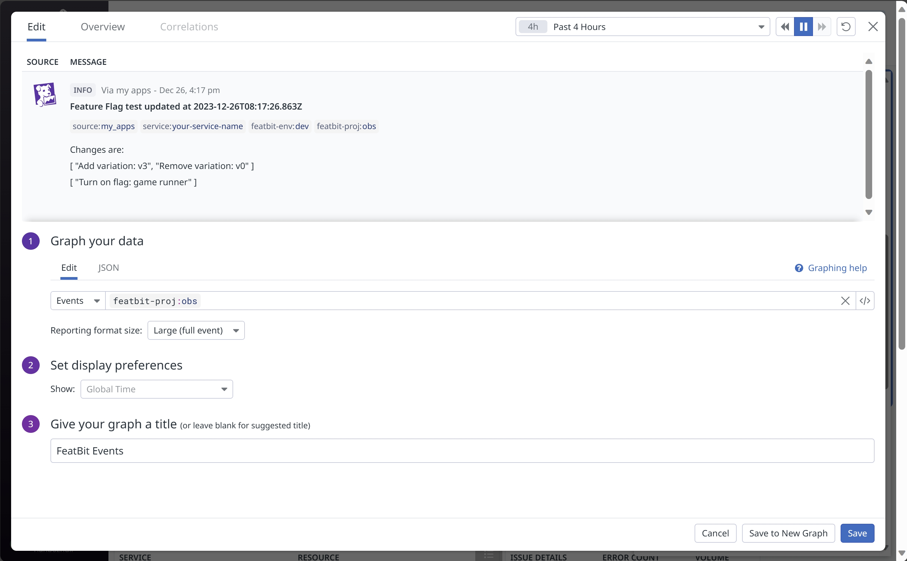

import { Callout } from 'nextra/components'

# DataDog

FeatBit offers the following ways to integrate with DataDog:

1. [Using the Datadog RUM integration](https://docs.datadoghq.com/real_user_monitoring/guide/setup-feature-flag-data-collection/?tab=browser#analyze-your-feature-flag-performance-in-rum) to send feature flag evaluation data to DataDog.
2. [Using the Datadog events integration](https://docs.datadoghq.com/api/?lang=bash#events) to receive activities from FeatBit such as Feature Flags updates.
3. Using flag triggers to rollback feature flag if a DataDog Metric drops below a certain threshold.
4. Export Feature Flags Insights to DataDog APM.

## Using the Datadog RUM integration

[Feature Flag Tracking](https://docs.datadoghq.com/real_user_monitoring/feature_flag_tracking/) gives you greater visibility into your user experience and performance monitoring by allowing you to determine which users are being shown a specific feature and if any change you introduce is impacting your user experience or negatively affecting performance.

### Setup feature flag data collection

To get started, you'll need to [set up DataDog feature flag data collection](https://docs.datadoghq.com/real_user_monitoring/guide/setup-feature-flag-data-collection). For **javascript/typescript** project, you need to initialize the RUM SDK and configure the `enableExperimentalFeatures` initialization parameter with `["feature_flags"]`. This will enable the feature flag tracking feature and send feature flag evaluation data to DataDog.

```javascript
datadogRum.init({
  applicationId: "sample-application-id",
  clientToken: "sample-client-token",
  site: "datadoghq.com",
  service: "demo-app",
  env: "dev",
  version: "1.0.0",
  sessionSampleRate: 100,
  sessionReplaySampleRate: 100,
  trackUserInteractions: true,
  trackResources: true,
  trackLongTasks: true,
  defaultPrivacyLevel: "mask-user-input",
  // This enables the beta feature flag tracking
  enableExperimentalFeatures: ["feature_flags"]
});

datadogRum.startSessionReplayRecording();
```

Then, you can use the `addFeatureFlagEvaluation` method built in to the datadogRum package when evaluating `FeatBit` Feature Flags.

```javascript
import { datadogRum } from "@datadog/browser-rum";
import fbClient from "featbit-js-client-sdk";

const flagEvalResult = fbClient.variation("feature-flag-key", flagsDefaultValues[prop] || '')
datadogRum.addFeatureFlagEvaluation("feature-flag-key", flagEvalResult);
```

If you don't want to write two lines of code everywhere, you can encapsulate the `.variation(...)` and `.addFeatureFlagEvaluation(...)` into a function. In our [React sample](https://github.com/featbit/featbit-samples/blob/main/samples/dino-game/interactive-demo-react/src/featBit/featBitSlice.js) and [Vue sample](https://github.com/featbit/featbit-samples/blob/main/samples/dino-game/interactive-demo-vue/src/featbit.js) projects, we create a `Flags Proxy` to provide a unified interface for getting feature flag values. So you can add the addFeatureFlagEvaluation to the Flags Proxy and use it like this:

```javascript
import { datadogRum } from "@datadog/browser-rum";
import fbClient from "featbit-js-client-sdk";

export const createFlagsProxy = () => {
    return new Proxy({}, {
        get(target, prop, _) {
          let returnValue = ''
          if(typeof prop === 'string' && !prop.startsWith('__v_')){
            returnValue = fbClient.variation(prop, flagsDefaultValues[prop] || '');
            datadogRum.addFeatureFlagEvaluation(prop, returnValue);
          }
          return returnValue;
        }
    })
}
```

So when you call feature a flag in your code, it will automatically send feature flag evaluation data to DataDog, as shown in the following code:

```typescript jsx
// Vue example with Pinia, code below also guarantees the real-time update of the feature flag value
<DinoGameCore v-if="featBitStore.flags['game-runner']== true"
              :difficulty="featBitStore.flags['difficulty-mode']" />

// React example with Redux, code below also guarantees the real-time update of the feature flag value
featureFlags["game-runner"] == true ? 
  <DinoGameCore difficulty={featureFlags["difficulty-mode"]} /> : <>

```


<Callout type="info">
**NOTE**: The tutorial above showed how to collect feature flag evaluation data in the browser. For other platforms such as iOS and Android, please refer to the [DataDog documentation](https://docs.datadoghq.com/real_user_monitoring/guide/setup-feature-flag-data-collection/?tab=ios#custom-feature-flag-management).
</Callout>


### Analyze your Feature Flag performance in RUM and APM


Once you have integrated FeatBit with DataDog, you can [analyze the performance of your feature flags in RUM](https://docs.datadoghq.com/real_user_monitoring/guide/setup-feature-flag-data-collection/?tab=browser#analyze-your-feature-flag-performance-in-rum). You can filter your **Sessions**, **Views**, and **Errors** using DataDog's RUM dashboard. For example, you can find all the errors in the specified time frame that occurred in the view where your FeatBit was evaluated, as shown in the figure below:


To view and analyze your feature flags, please refer to [DataDog Feature Flags Tracking tutorial](https://docs.datadoghq.com/real_user_monitoring/feature_flag_tracking/#view-your-feature-flags).

If you are using [DataDog APM](https://www.datadoghq.com/product/apm/), DataDog provides a method to connect your front-end feature flag data to your traces. See [Connect Rum and Traces](https://docs.datadoghq.com/real_user_monitoring/connect_rum_and_traces/?tab=browserrum). This way you can have alerts based on both front-end and back-end errors.


## Using the DataDog events integration

The Datadog integration lets you set up [Datadog Events](https://docs.datadoghq.com/api) to receive any activity from FeatBit. When something changes, such as a feature flag updates or a new account member is added to FeatBit, FeatBit sends an event to Datadog. Use this integration to correlate and understand how changes to your features in FeatBit impact your app and infrastructure metrics.

The image below shows the correlation discovered between a feature flag event and the failure detections in a service APM dashboard. After we turned off the feature flag, the outage disappeared.


### Setting up WebHook for DataDog events integration

You can use FeatBit's Webhook to subscribe to changes in Feature Flags, then create an event sender for DataDog.

1. On the menu, under **Integrations**, select **Webhook** to access the webhook configuration page.
2. Click the **+ Add** button. 
3. In the 'Add Webhook' drawer, enter the **Name** for the webhook.
4. Enter the URL of the DataDog Events API. You can find the API URL in the [official tutorial](https://docs.datadoghq.com/api/latest/events/?code-lang=curl#post-an-event).
5. Select the scope of WebHook you wish to subscrilbe to by choosing the **Project** and **Environments**.
6. Choose the **Events** you want to subscribe to. For this tutorial, select **Flag Change** and **Segment**.
7. Add the header **DD-API-KEY** for authorization. You can find the API key [in this official tutorial](https://docs.datadoghq.com/account_management/api-app-keys/#add-an-api-key-or-client-token).
8. In the **Payload Template** enter the following template (you can also customize your own payload template):

```handlebars
{
{{#eq data.kind "feature flag"}}
  "title": "Feature Flag {{data.object.key}} updated at {{happenedAt}}",
{{/eq}}
{{#eq data.kind "segment"}}
  "title": "Segment {{data.object.name}} updated at {{happenedAt}}",
{{/eq}}
  "text": "Changes are: {{#each changes}}{{this}}{{#unless @last}} ; {{/unless}}{{/each}}",
  "source_type_name": "featbit",
  "alert_type": "info",
  "tags": [
    "featbit-env:{{environment.name}}",
    "featbit-proj:{{project.name}}"
  ]
}
```

**For more information about WebHook, please refer this [tutorial](/integrations/webhooks).**


9. Test your webhook configuration by clicking on the **Test your webhook configuration** link. If the test is successful, you will see a success message. If the test fails, you will see an error message.


10. You will see the webhook you created in the webhook list.

### Adding an Events View to Your Dashboard

The easiest way to view event history is by creating a widget on your dashboard, as shown below:



By organizing your Dashboard and configuring your APM services, you can correlate and understand how changes to your features in FeatBit impact your application and infrastructure metrics.

## Using flag triggers with Datadog

[DataDog's Webhook](https://docs.datadoghq.com/integrations/webhooks/) allows you to notify your services when a metric alert is triggered. In the Webhook configuration, you can choose to directly call a [FeatBit Flag Trigger](../feature-flags/feature-workflow/flag-triggers) to toggle on/off a feature flag, or call a [FeatBit REST API](../api-docs/using-featbit-rest-api) rollout/rollback to a specific group of users. Here's how to configure the Webhook to call a Flag Trigger:

1. You need to first create a Flag Trigger in a Feature Flags. See [Workflow/Flag Triggers](/feature-flags/feature-workflow/flag-triggers).


2. In the DataDog Integration, create a new WebHook and copy the Flag Trigger URL in the new WebHook.


3. Go to the Monitor page, create a metric with a search query and condition. Then add `@webhook-name_of_the_webhook` to the text of the alert. The webhook will be triggered when the metric falls below the threshold set in the condition.


4. After the WebHook is triggered, the feature flag is automatically toggled on/off.

## Export Feature Flags Insights to DataDog APM

Datadog provides various tools and features for monitoring the performance and behavior of applications and systems. You can use **Metrics** to assess the health of your environment at a glance. Visualize how quickly users are loading your website, or the average memory consumption of your servers, for instance. Once you identify a problem, you can use **logs** and **tracing** to further troubleshoot.

In additional sending activity events to APM as mentioned above ([Using the Datadog events integration](#using-the-datadog-events-integration)), you can deeply integrate with DataDog APM and Metrics by exporting FeatBit's Feature Flag Insights data (for both front-end and back-end feature flag usage data) and custom event data to DataDog via **ClickHouse** in the Pro version or **MongoDB** in the Standard version. Then you can choose Metrics for an overview of flag usage (counts, high-level impact) and Traces for deep insight into how flags affect individual requests. Using both metrics and traces can provide a comprehensive view of feature flag behavior and application performance.

**We hope to hear from your if you have any ideas about this implementation**.