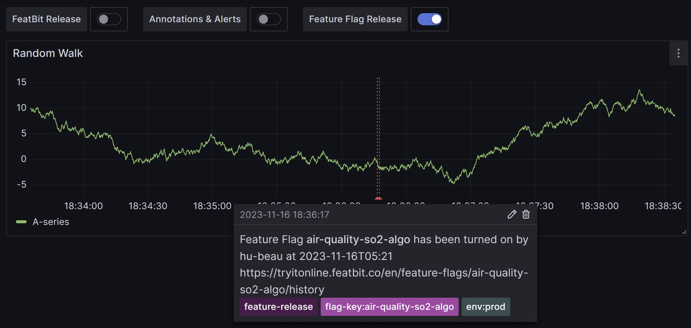
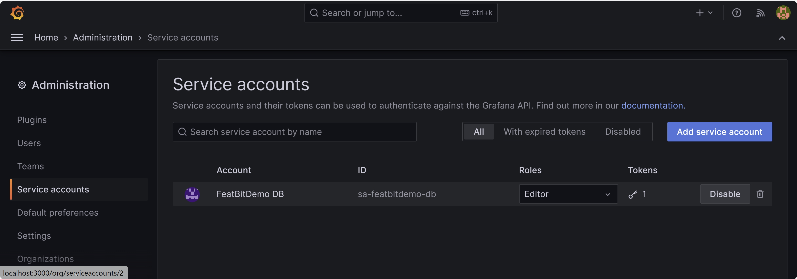
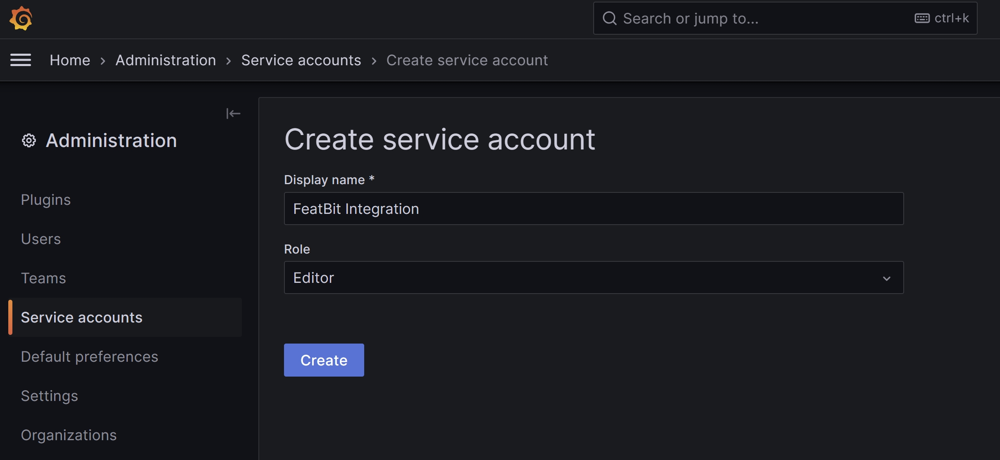
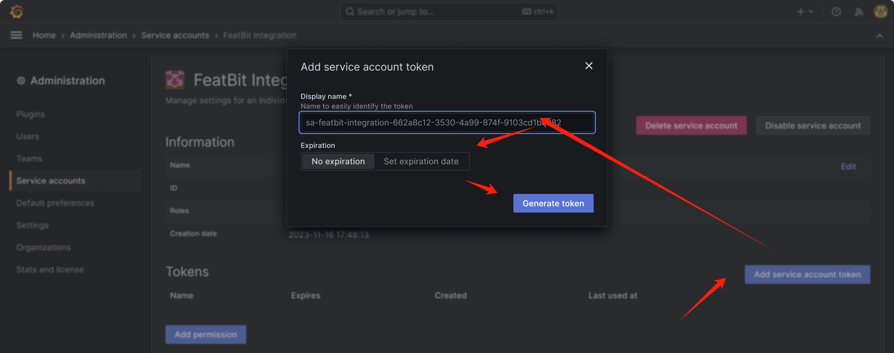
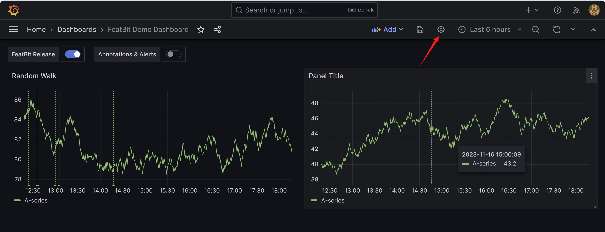
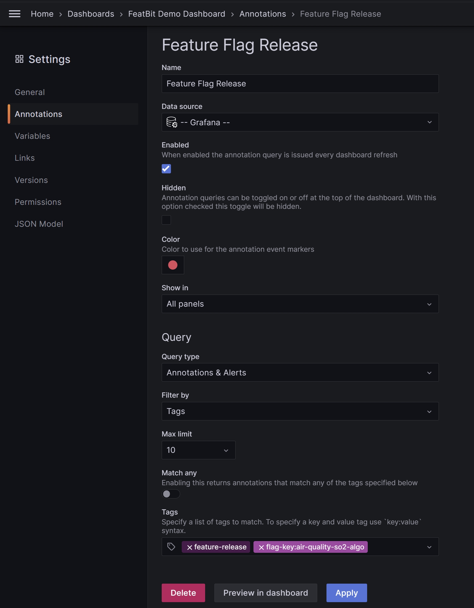

import { Callout } from 'nextra/components'

# Grafana

## Overview

You can utilize FeatBit's Webhook integration to transmit updates about flags, environments, and projects to Grafana. These updates will appear as annotations, adding contextual information to your graphs. The figure below is an example:

## Create Service Accounts for Integration

To use the Grafana integration, you need to create a Grafana service account and generate a service account token:

1. In Grafana, open the the **Administration** menu and select "Service accounts." The "Service accounts" tab appears.

2. Click **Add service account**. The "Create service account" page appears.
3. Enter a **Display name**.
4. Change the **Role** selection to "Editor"

5. Click **Create**. The "Service token" page appears.
6. Click **Add service account token**.
7. Enter a **Display name** for the token.
8. Click **Generate token**.

9. Copy the token and save if somewhere secure. Grafana displays this token only once, so you must copy and store it now. You will use it to set up the Grafana integration in LaunchDarkly.

## Setting up WebHook for Grafana integration

You can use FeatBit's Webhook to subscribe to changes in Feature Flags, then create an event sender for Grafana.

The related documentation will be provided after the Webhook feature is released.

## Adding FeatBit annotations to Grafana dashboards

To add FeatBit Webhook events as annotations in Grafana dashboards:

1. Open the Grafana dashboard in edit mode.
2. Click the Dashboard settings gear icon button located at the top of the page.

3. Click **Annotations**.
4. Click **New query**. The "New annotation" page appears.
5. Enter a human readable name for the annotation, such as "LaunchDarkly feature flags."
6. In the **Data source** menu, select "-- Grafana --."
7. In the **Filter by** menu, select "Tags."
8. In the **Tag** field, enter tag(s) that you specified in the webhook. These are tags that you used to filter the annotations that appear on your dashboard.

9. Click **Save Dashboard**. Then, return to the Dashboard, and you will see the annotations appear on the graph. 

> You can disable the annotations by clicking the toggle at the top of the dashboard.