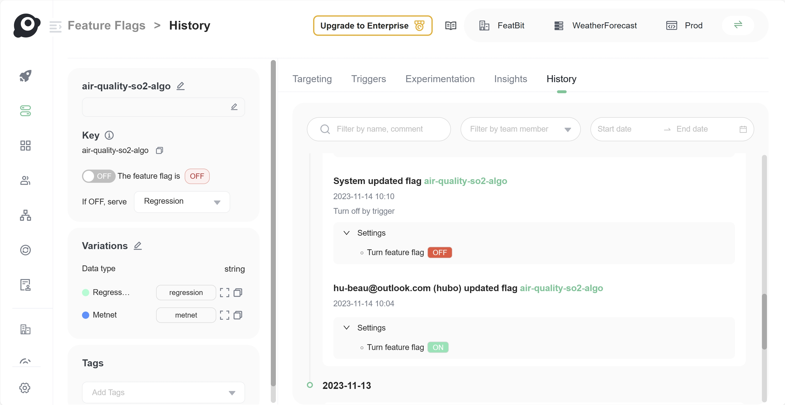

import { Callout } from 'nextra/components'

# New Relic One

FeatBit offers the following ways to integrate with New Relic One:

1. FeatBit sends feature flag change events to New Relic as deployment events and then can be used for change tracking, for example.
2. Use a FeatBit trigger (or API) to toggle a flag's targeting on or off when a performance metric drops below a certain threshold.

## Using the New Relic One events integration

### Subscribe flag changes then send to New Relic One

You can use FeatBit's Webhook to subscribe to changes in Feature Flags, then create an event sender (Deployment Event) for New Relic One.

1. On the menu, under **Integrations**, select **Webhook** to access the webhook configuration page.
2. Click the **+ Add** button. 
3. In the 'Add Webhook' drawer, enter the **Name** for the webhook.
4. Enter the URL of the New Relic One Deployment Event API. You can find the API URL in the [official tutorialofficial tutorial](https://docs.newrelic.com/docs/apm/apm-ui-pages/events/record-deployments/#api-instructions).
5. Select the scope of WebHook you wish to subscrilbe to by choosing the **Project** and **Environments**.
6. Choose the **Events** you want to subscribe to. For this tutorial, select **Flag Change** and **Segment**.
7. Add the header **X-Api-Key** for authorization. You can find the API key [in this official tutorial](https://docs.newrelic.com/docs/apis/intro-apis/new-relic-api-keys/).
8. In the **Payload Template** enter the following template (you can also customize your own payload template):

```json
{
    "deployment": {
{{#eq data.kind "feature flag"}}
        "revision": "Feature Flag {{data.object.key}} updated at {{happenedAt}}",
{{/eq}}
{{#eq data.kind "segment"}}
        "revision": "Segment {{data.object.name}} updated at {{happenedAt}}",
{{/eq}}
        "changelog": "Changes are: {{#each changes}}{{this}}{{#unless @last}} ; {{/unless}}{{/each}}",
        "description": "{{project.name}}/{{environment.name}}: {{#each changes}}{{this}}{{#unless @last}} ; {{/unless}}{{/each}}",
        "user": "FeatBit Webhook"
    }
}
```

**For more information about WebHook's payload template, please refer this [tutorial](/integrations/webhooks).**


9. Test your webhook configuration by clicking on the **Test your webhook configuration** link. If the test is successful, you will see a success message. If the test fails, you will see an error message.


10. You will see the webhook you created in the webhook list.

### Analyze Deployment Impact in APM

To view FeatBit events in New Relic One, navigate to your application's APM dashboard and select the app you have configured for the New Relic One webhook. You can then track changes via:

1. The Summary page, to directly view the impact of that flag change.
2. The Change Tracking page, to view the deployment events.


For example, the figure above illustrates:

1. A noticeable rise in Web Transaction Time and Errors occurs following the activation of a feature flag.
2. A critical issue is identified.
3. Subsequently, the feature flag is turned off automatically in response to the triggered alert.
4. The response time peak and error rates return to normal.
5. The critical issue is successfully resolved.

Click on the activity stream items to clearly observe the differences before and after the feature flag deployment event. The image below demonstrates the comparison between the events when the feature flag is turned on and off.


## Using flag triggers with New Relic One

You can use FeatBit's triggers to toggle a flag's targeting on or off when a performance metric drops below a certain threshold. [New Relic One's Webhook](https://newrelic.com/instant-observability/webhook-notifications) allows you to notify your services when a metric alert is triggered. In the Webhook configuration, you can choose to directly call a [FeatBit Flag Trigger](../feature-flags/feature-workflow/flag-triggers) to toggle on/off a feature flag, or call a [FeatBit REST API](../api-docs/using-featbit-rest-api) rollout/rollback to a specific group of users. Here's an example of how I created alert in the sample above:


### Create feature flag trigger

You need to first create a Flag Trigger in a Feature Flags. See [Workflow/Flag Triggers](/feature-flags/feature-workflow/flag-triggers). For this tutorial's use case, you need to create a trigger to deactivate the feature flag.


### Set Up Alert

Click the "Set up alerts" button on the right side.


Configure the alert by following New Relic's instructions and selecting your preferred metrics. Specify what should be monitored:


Set threholds:


Add a webhook as the notification destination:


### Set the webhook URL to call FeatBit's trigger

In the webhook editor, enter the URL of the trigger you just created.


Test the notification and save.


### Show Trigger History in Feature Flag's Audit Log

In the 'Analyze Deployment Impact in APM' section, we mentioned that the feature flag's trigger is automatically activated following an alert, and a deployment event is recorded alongside the alert. It's also possible to view the trigger action in the Feature Flag's Audit Log. The figure below shows the trigger action recorded as a 'System update flag' event, described as Turned off by trigger.

