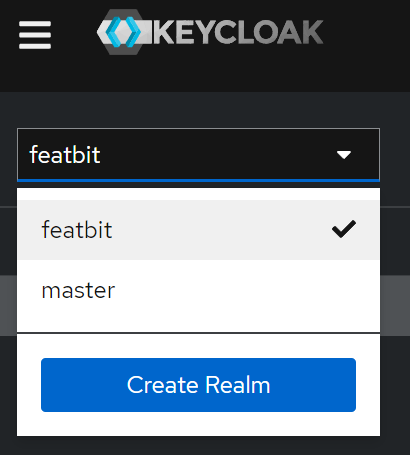
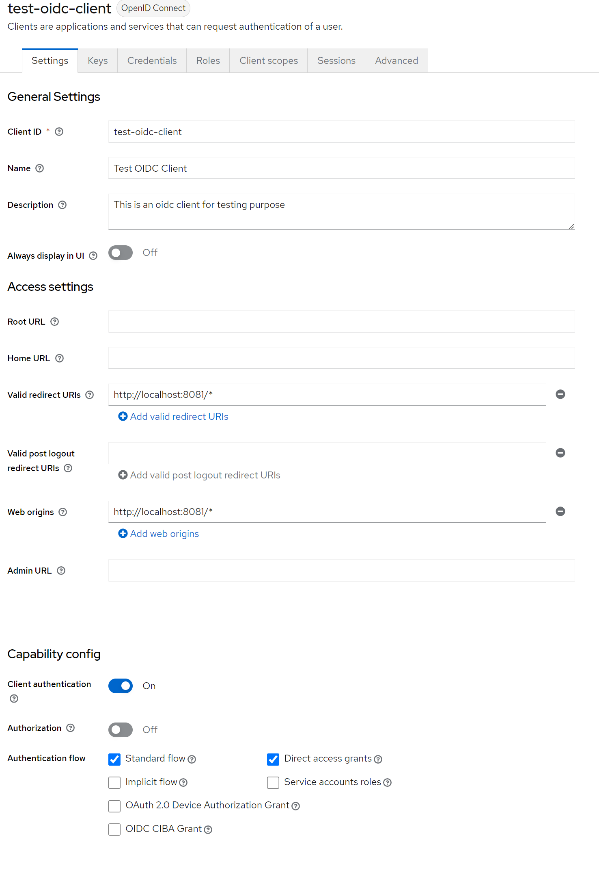

import {Callout} from 'nextra/components'

# Single Sign-On

<Callout type="info">
    The Single-Sign-On capability is only available for customers on the Enterprise subscription. Check out the [FeatBit plans](https://dashboard.featbit.co/en) for details.
</Callout>

SSO is available on FeatBit Self-hosted via OpenID Connect. To enable SSO on your self-hosted FeatBit instance, you will need an active license key, and then you may add the SSO settings for your provider.

## SSO Settings

To enable SSO, you will need to add the following environment variables for the FeatBit Api service

- `SSO__enabled`: Set to `true` to enable SSO.
- `SSO__OIDC__clientId`: The OIDC client ID.
- `SSO__OIDC__clientSecret`: The OIDC client secret.
- `SSO__OIDC__redirectUri`: The OIDC redirect URI.
- `SSO__OIDC__tokenEndpoint`: The OIDC token endpoint.
- `SSO__OIDC__clientAuthenticationMethod`: The OIDC client authentication method. Set to `client_secret_post` for most of the time, we also support `client_secret_basic`.
- `SSO__OIDC__authorizationEndpoint`: The OIDC authorization endpoint.
- `SSO__OIDC__scope`: The OIDC scopes to request. Set to `openid profile email` for most of the time.
- `SSO__OIDC__userEmailClaim`: The OIDC user email claim. Set to `email` if you use the above scope.

## Example

We have tested FeatBit SSO with **Keycloak, Okta, and Auth0**. Let's take Keycloak as an example.

1. Run keycloak from docker and log in the admin console with `admin`/`admin` at [localhost:9000](http://localhost:9000)
    ```bash
    docker run -d -p 9000:8080 -e KEYCLOAK_ADMIN=admin -e KEYCLOAK_ADMIN_PASSWORD=admin --name=keycloak quay.io/keycloak/keycloak:22.0.1 start-dev
    ```
2. Create a new realm called `featbit` and switch to that realm

    
3. Create an OIDC client with these settings, here are some important settings:
    - Set the client's Valid Redirect URIs to http://localhost:8081/* (FeatBit UI service address)
    - Set the client's Web Origins to http://localhost:8081/* (FeatBit UI service address)
    - Enable Client authentication

    
4. Create a user on KeyCloak and set a password for that user
5. Setting the following environment variables for FeatBit Api Service in `docker-compose.yml`, please **replace the client secret** with your own value

    ```yaml
    SSO__enabled=true
    SSO__OIDC__clientId=test-oidc-client
    SSO__OIDC__clientSecret=dfFJlh6Fac7wdktbmzzW3RGtzxDWS0Ho
    SSO__OIDC__redirectUri=http://localhost:8081/login?sso-logged-in=true
    SSO__OIDC__tokenEndpoint=http://host.docker.internal:9000/realms/featbit/protocol/openid-connect/token
    SSO__OIDC__clientAuthenticationMethod=client_secret_post
    SSO__OIDC__authorizationEndpoint=http://localhost:9000/realms/featbit/protocol/openid-connect/auth
    SSO__OIDC__scope=openid profile email
    SSO__OIDC__userEmailClaim=email
    ```
6. Start FeatBit and you should see the SSO button on the login page
    ```bash
    cd featbit
    docker-compose up -d
    ```
    
7. Click the `Login with SSO` link button and the browser will take you to the Keycloak login page, then you can log in with the user you created in step 4

