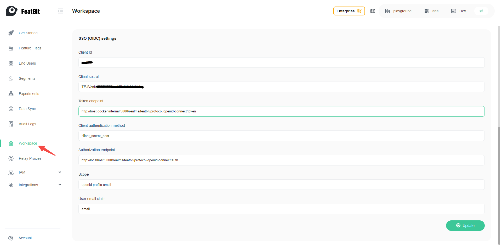

import {Callout} from 'nextra/components'

# Single Sign-On

<Callout type="info">
    This article is compatible with FeatBit 3.0.0 and above.
</Callout>

<Callout type="info">
    The Single-Sign-On capability is only available for customers on the Enterprise subscription. Check out the [FeatBit plans](https://dashboard.featbit.co/en) for details. You can also try this feature with a trial license, the trial license can be generated here [Featbit dashboard](https://dashboard.featbit.co/account)
</Callout>

SSO is available on FeatBit Self-hosted via OpenID Connect. To enable SSO on your self-hosted FeatBit instance, you will need an active license key, and then you may add the SSO settings for your provider.

## SSO Settings

To enable SSO, you will need to add the following settings

### Add environment variable for the FeatBit Api service

- `SSOEnabled`: Set to `true` to enable SSO.

### Add OpenId Connect settings via UI

Once FeatBit successfully launched, go to the UI **http://localhost:8081/workspace** and add the following settings:

- `clientId`: The OIDC client ID.
- `clientSecret`: The OIDC client secret.
- `redirectUri`: The OIDC redirect URI.
- `tokenEndpoint`: The OIDC token endpoint.
- `clientAuthenticationMethod`: The OIDC client authentication method. Set to `client_secret_post` for most of the time, we also support `client_secret_basic`.
- `authorizationEndpoint`: The OIDC authorization endpoint.
- `scope`: The OIDC scopes to request. Set to `openid profile email` for most of the time.
- `userEmailClaim`: The OIDC user email claim. Set to `email` if you use the above scope.

## Example

We have tested FeatBit SSO with **Keycloak, Okta, and Auth0**. Let's take Keycloak as an example.

1. Run keycloak from docker and log in the admin console with `admin`/`admin` at [localhost:9000](http://localhost:9000)
    ```bash
    docker run -d -p 9000:8080 -e KEYCLOAK_ADMIN=admin -e KEYCLOAK_ADMIN_PASSWORD=admin --name=keycloak quay.io/keycloak/keycloak:22.0.1 start-dev
    ```
2. Create a new realm called `featbit` and switch to that realm

    
3. Create an OIDC client with these settings, here are some important settings:
    - Set the client's Valid Redirect URIs to http://localhost:8081/* (FeatBit UI service address)
    - Set the client's Web Origins to http://localhost:8081/* (FeatBit UI service address)
    - Enable Client authentication

    

4. Create a user on KeyCloak and set a password for that user

5. Setting the following environment variables for FeatBit Api Service in `docker-compose.yml`

    ```yaml
    SSOEnabled=true
    ```
6. Start FeatBit and you should see the SSO tab on the login page
    ```bash
    cd featbit
    docker-compose up -d
    ```
    

7. You need firstly to log in with your username and password

8. Add the user created in step 4 to your team here **http://localhost:8081/iam/team**, you can ignore the default password, you won't need it.


9. Go to **http://localhost:8081/workspace** and add your OpenID Connect settings and click on **Update**, please **replace the client secret** with your own value


10. In the same page copy the workspace key in the **General settings**, you will need it when login with SSO


11. Log out and then Click SSO, use the workspace key copied in step 10 and click on **Continue**, the browser will take you to the Keycloak login page, then you can log in with the user you created in step 4


