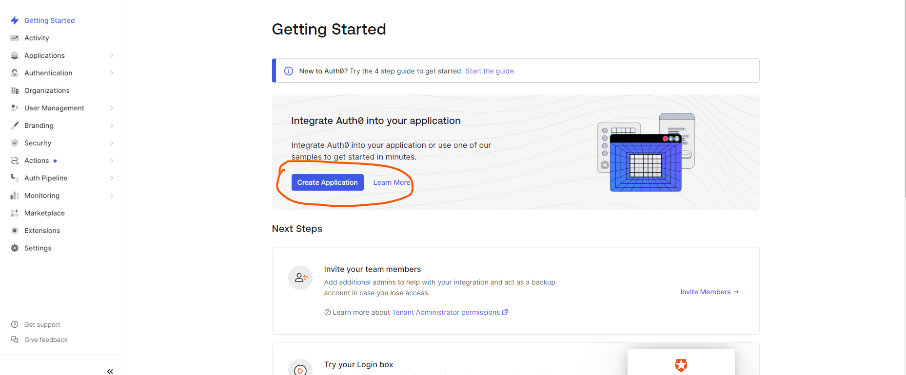
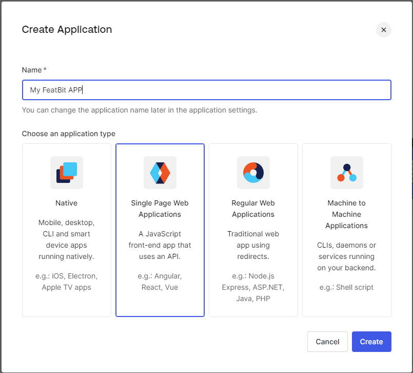
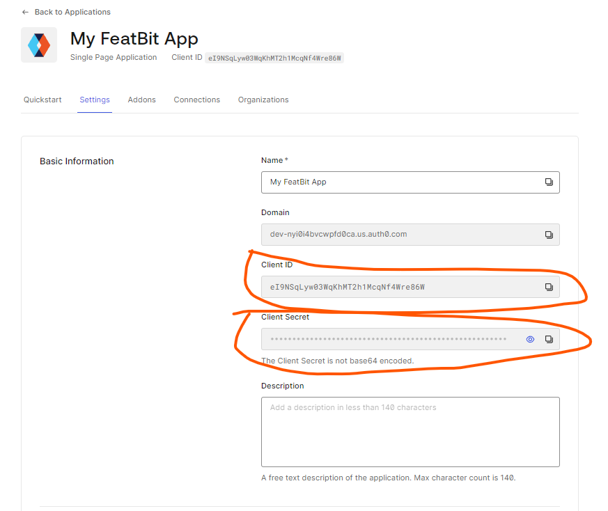
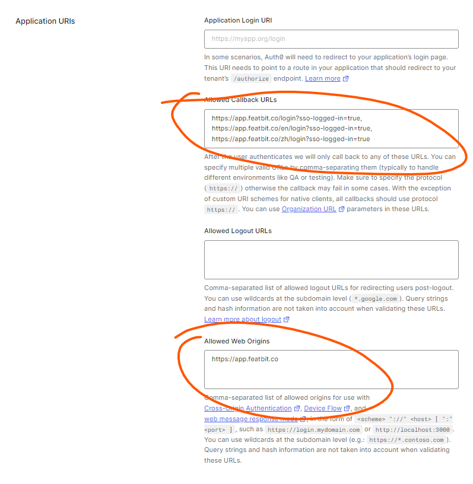
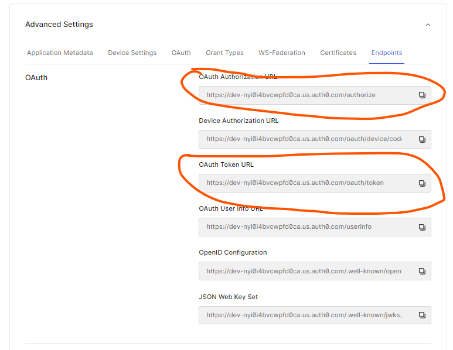
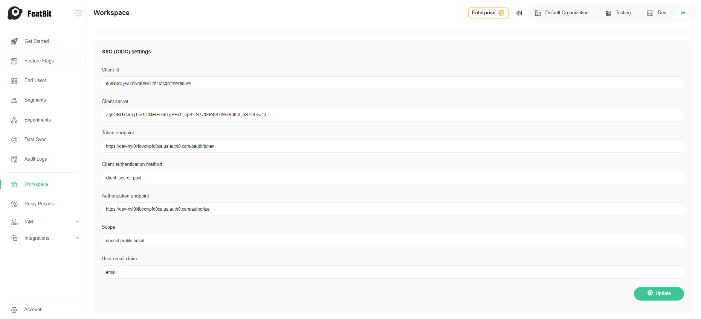

import {Callout} from 'nextra/components'

# Single Sign-On with Auth0

<Callout type="info">
    All the tokens, secrets etc. listed in this page are temporary and are for demonstration purpose only, they should be replaced with your real values.
</Callout>

## Overview

This is a step-by-step guide using Auth0 as an Identity Provider (IdP) and FeatBit as a Service Provider (SP) to authenticate users to FeatBit.

The final configuration should be similar to the following:
```json
{
    "clientId": "eI9NSqLyw03WqKhMT2h1McqNf4Wre86W",
    "clientSecret": "ZghOBGxQrrcj1Iw3DdJiRE5k6TgPFJT_epSUG7v0XPibS7IWxRdIL8_bS7OLyw1J",
    "tokenEndpoint": "https://dev-nyi0i4bvcwpfd0ca.us.auth0.com/oauth/token",
    "clientAuthenticationMethod": "client_secret_post",
    "authorizationEndpoint": "https://dev-nyi0i4bvcwpfd0ca.us.auth0.com/authorize",
    "userEmailClaim": "email",
    "scope": "openid profile email"
}
```

## SSO Settings

Once you have registered an account with Auth0, you can follow the steps below to configure Auth0 as an IdP for FeatBit.

### Create Application in Auth0
Please follow the following screenshots to create an application in Auth0. The Application Type should be **Single Page Web Applications**.





### Configure Application in Auth0
1. Go to the `Settings` tab of the application you just created, copy the `Client ID` and `Client Secret` to the FeatBit SSO configuration page.


2. Scroll down to Applicaion URIs section, add the following URLs to the `Allowed Callback URLs` and `Allowed Web Origins` fields.
    - Allowed Callback URLs: `https://app.featbit.co/login?sso-logged-in=true`, `https://app.featbit.co/en/login?sso-logged-in=true`, `https://app.featbit.co/zh/login?sso-logged-in=true`
    - Allowed Web Origins: `https://app.featbit.co`


3. Scroll down to the `Advanced Settings` section, Copy the following values from the `Endpoints` section as follows:
    - OAuth Authorization URl
    - OAuth Token URL


4. Click on **Save Changes** button to save the changes.

### Configure FeatBit SSO

1. Go to FeatBit Workspace page: [SSO configure](https://app.featbit.co/en/workspace) and scroll down to the **SSO (OIDC) settings** section

2. Fill in the following fields with values copied from Auth0:
    - **Client Id**
    - **Client secret**
    - **Token endpoint**
    - **Authorization endpoint**

3. For the following fields, you can use the values provided here:
    - **Client authentication method**: `client_secret_post`
    - **User Email Claim**: `email`
    - **Scope**: `openid profile email`

4. The final configuration should be similar to the following:


5. Click on **Save** button to save the changes.

6. Log In with SSO. Copy the workspace key in the **General settings**, you will need it when login with SSO,


then Log out and click SSO, use the workspace key copied earlier.
Click **Continue** and the browser should take you to the Auth0 login page, then you can log in with the user you created previously.