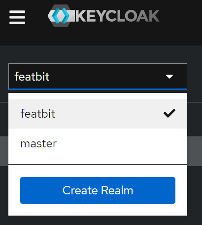
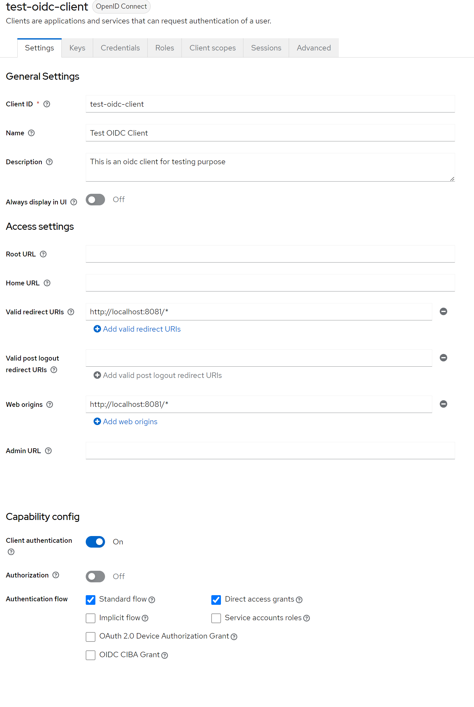
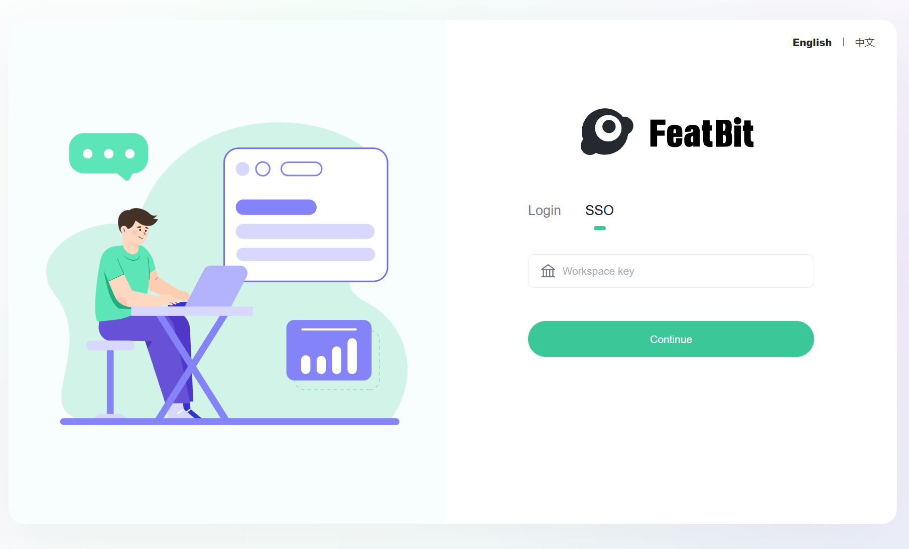
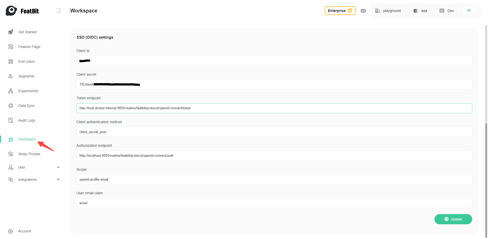

import {Callout} from 'nextra/components'

# Single Sign-On with KeyCloak

<Callout type="info">
    All the tokens, secrets etc. listed in this page are temporary and are for demonstration purpose only, they should be replaced with your real values.
</Callout>

## Overview

This is a step-by-step guide using KeyCloak as an Identity Provider (IdP) and FeatBit as a Service Provider (SP) to authenticate users to FeatBit.

The final configuration should be similar to the following:
```json
{
    "clientId": "test-oidc-client",
    "clientSecret": "tr8XwUrWo8U2wdJFb7EZ5HbqVWZEns5V",
    "redirectUri": "http://localhost:4200/login?sso-logged-in=true",
    "tokenEndpoint": "http://localhost:9000/realms/featbit/protocol/openid-connect/token",
    "clientAuthenticationMethod": "client_secret_post",
    "authorizationEndpoint": "http://localhost:9000/realms/featbit/protocol/openid-connect/auth",
    "userEmailClaim": "email",
    "scope": "openid profile email"
  }
```

## SSO Settings

### 1. Run Keycloak
Run keycloak from docker and log in the admin console with `admin`/`admin` at [localhost:9000](http://localhost:9000)

```bash
docker run -d -p 9000:8080 -e KEYCLOAK_ADMIN=admin -e KEYCLOAK_ADMIN_PASSWORD=admin --name=keycloak quay.io/keycloak/keycloak:22.0.1 start-dev
```

### 2. Create a realm

Create a new realm called `featbit` and switch to that realm



### 3. Create an OIDC Client

Create an OIDC client with these settings, here are some important settings:
- Set the client's Valid Redirect URIs to http://localhost:8081/* (FeatBit UI service address)
- Set the client's Web Origins to http://localhost:8081/* (FeatBit UI service address)
- Enable Client authentication



### 4. Create a User
Create a user on KeyCloak and set a password for that user

### 5. Start FeatBit

Setting the following environment variables for FeatBit Api Service in `docker-compose.yml`.

```yaml
SSOEnabled=true
```

Start FeatBit and you should be able to see the SSO tab on the login page.
```bash
cd featbit
docker-compose up -d
```


Then click the `Login` tab and log in with the default credentials `test@featbit.com`/`123456`

### 6. Configure OIDC Settings

Go to **http://localhost:8081/workspace** and add your OpenID Connect settings and click on **Update**, please **replace the client secret** with your own value



### 7. Log In with SSO
Copy the workspace key in the **General settings**, you will need it when login with SSO


Log out and click SSO, use the workspace key copied earlier.
Click **Continue** and the browser should take you to the Keycloak login page, then you can log in with the user you created previously.
