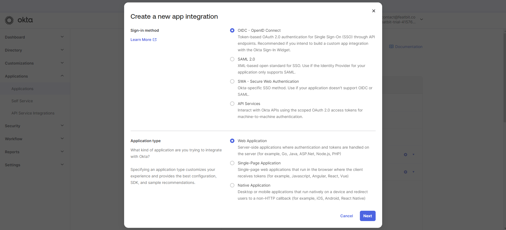
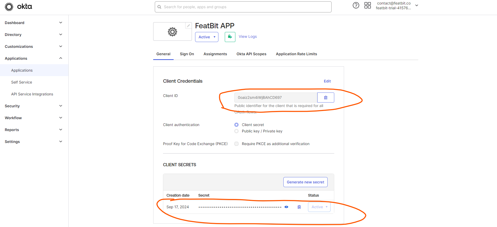
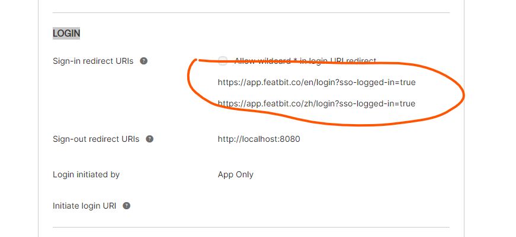
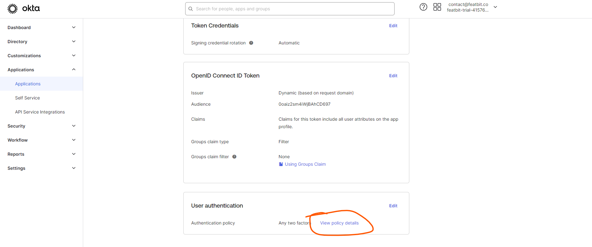
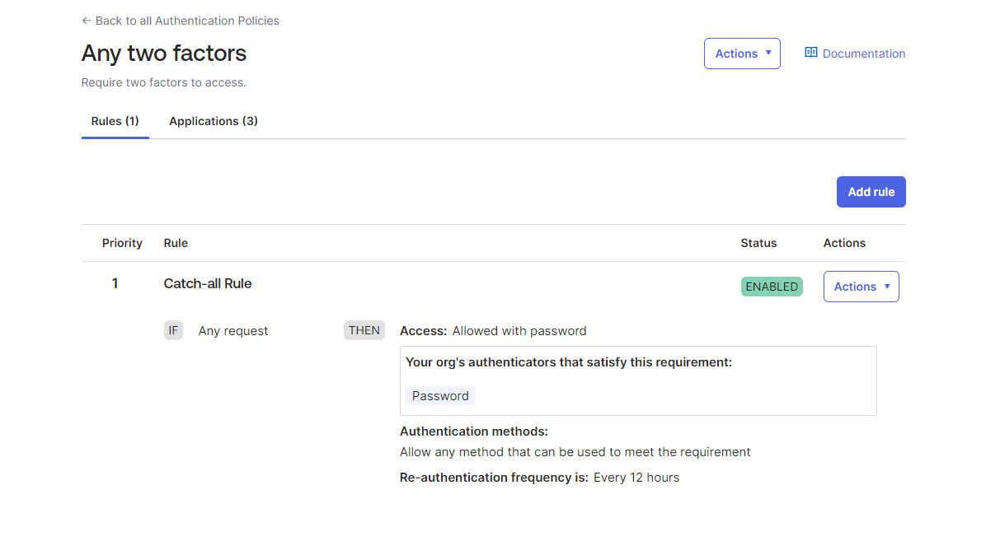
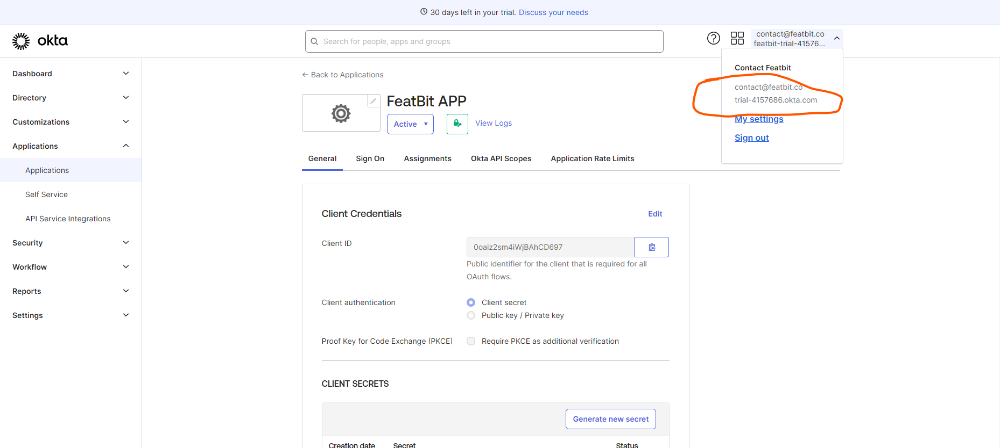
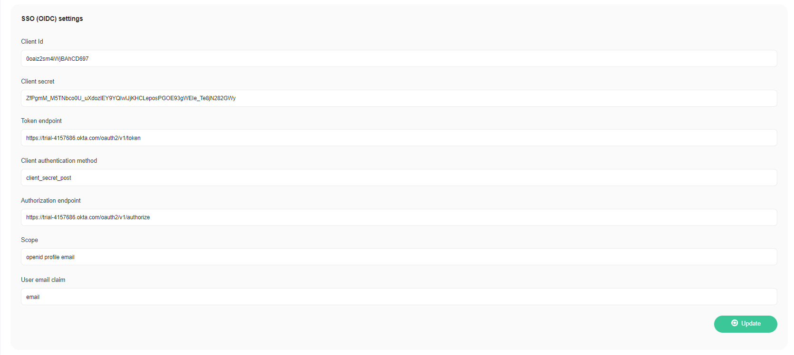
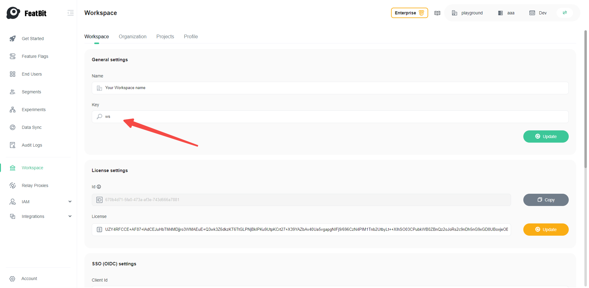

import {Callout} from 'nextra/components'

# Single Sign-On with Okta

<Callout type="info">
    All the tokens, secrets etc. listed in this page are temporary and are for demonstration purpose only, they should be replaced with your real values.
</Callout>

## Overview

This is a step-by-step guide using okta as an Identity Provider (IdP) and FeatBit as a Service Provider (SP) to authenticate users to FeatBit.

The final configuration should be similar to the following:
```json
{
    "clientId": "0oaiz2sm4iWjBAhCD697",
    "clientSecret": "ZfPgmM_M5TNbco0U_uXdozlEY9YQlwIJjKHCLeposPGOE93gWEIe_Te8jN282GWy",
    "tokenEndpoint": "https://trial-4157686.okta.com/oauth2/v1/token",
    "clientAuthenticationMethod": "client_secret_post",
    "authorizationEndpoint": "https://trial-4157686.okta.com/oauth2/v1/authorize",
    "userEmailClaim": "email",
    "scope": "openid profile email"
}
```

## SSO Settings

Once you have registered an account with okta, you can follow the steps below to configure okta as an IdP for FeatBit.

### Create Application in okta

While creating the application, you will need to select the `OIDC - OIpenId Connect` as **Sign-in method** and `Web Application` as **Applciation type** as the screenshot:



### Configure Application in okta

1. Go to the `General` tab of the application you just created, copy the `Client ID` and `Client Secret` to the FeatBit SSO configuration page.


2. Add redirect URIs
 - Scroll down to `General Settings` section, click on `Edit`.
 - In the `LOGIN` section, add to sign-in redirect URIs the following URIs:
    - `https://app.featbit.co/en/login?sso-logged-in=true`,
    - `https://app.featbit.co/zh/login?sso-logged-in=true`


3. Go to the `Sign On` tab, scroll down to `User authentication`, click on `View policy details`


4. In the newly opened page, make sure you have the following settings:


### Configure FeatBit SSO

1. Go to FeatBit Workspace page: [SSO configure](https://app.featbit.co/en/workspace) and scroll down to the **SSO (OIDC) settings** section

2. Fill in the following fields with values copied from okta:
    - **Client Id**
    - **Client secret**
    - **Token endpoint**
    - **Authorization endpoint**

3. For the following fields, you can use the values provided here:
    - **Client authentication method**: `client_secret_post`
    - **User Email Claim**: `email`
    - **Scope**: `openid profile email`

4. For the following fields, you can use the values provided here:
    - **Token endpoint**: `https://trial-4157686.okta.com/oauth2/v1/token`, replace `trial-4157686.okta.com` with your own okta account.
    - **Authorization endpoint**: `https://trial-4157686.okta.com/oauth2/v1/authorize`, replace `trial-4157686.okta.com` with your own okta account.

    Your account information can be found here:
    

5. The final configuration should be similar to the following:


6. Click on **Update** button to save the changes.

7. Copy the workspace key in the **General settings**, you will need it when login with SSO,


then Log out and click SSO, use the workspace key copied earlier.
Click **Continue** and the browser should take you to the okta login page, then you can log in with the user you created previously.