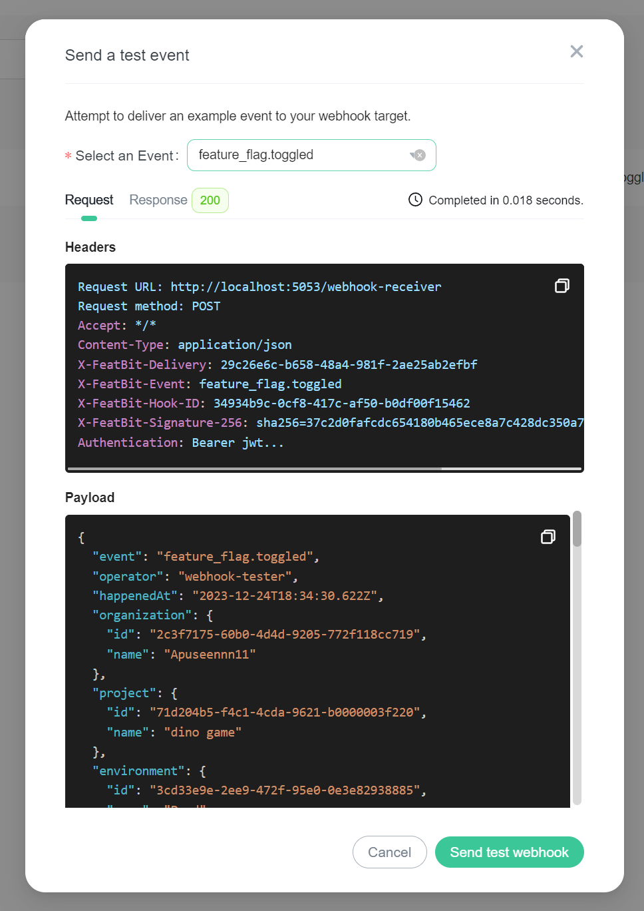
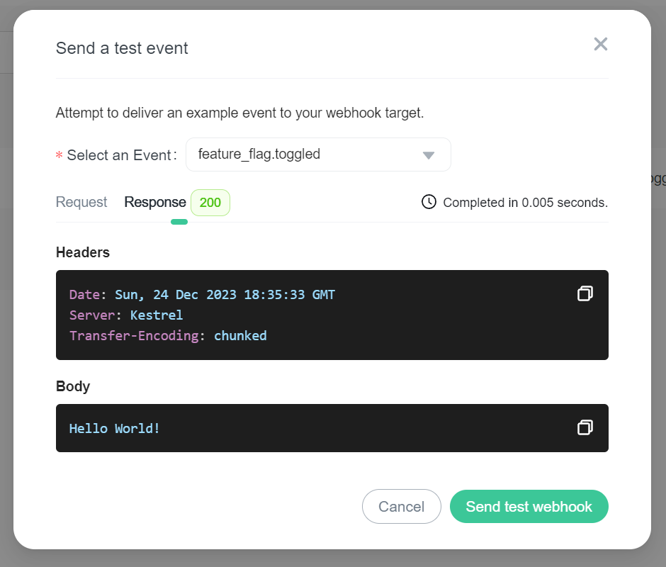

# Webhooks

## Overview

This topic explains how to create and use webhooks in FeatBit. FeatBit's webhooks allow you to build your own
integrations that subscribe to flag/segment changes in FeatBit. When a feature flag or a segment is updated,
FeatBit sends an HTTP POST payload to the webhook's configured URL.

## Creating a webhook

To create a webhook:

1. Navigate to the **Integrations/Webhooks** page in the FeatBit dashboard.
2. Click **Add Webhook**.
3. Enter a human-readable **Name** for the webhook.
4. Enter the **URL** that FeatBit should send the HTTP POST payload to.
5. Select the **Scopes(environments)** that this webhook should monitor. The webhook will be triggered for events in any of the selected environments.
6. Select the **Events** you would like to trigger this webhook.
7. Optionally, you can add some custom **Headers** to the webhook request. Checkout "[Delivery headers](#delivery-headers)" for more information.
8. Configure the **Payload Template**. This is a Handlebars template that will be used to generate the payload sent to the webhook URL. Checkout "[Payload template](#payload-template)" for more information.
9. Optionally, enter a secret. If you enter a secret, FeatBit will send the secret in the **X-FeatBit-Signature-256** header of the webhook payload. Checkout "[Validating webhook deliveries](#validating-webhook-deliveries)" for more information.
10. Set the webhook **Active** status.
11. Optionally, you can perform a **Live Debug** before saving the webhook. This will send a test payload to the webhook URL and show the request/response details. Checkout "[Live Debug](#live-debug)" for more information.
12. Click **Save**.

## Delivery headers

HTTP POST payloads that are delivered to your webhook's configured URL endpoint will contain several built-in headers:

- `X-FeatBit-Delivery`: A globally unique identifier (GUID) to identify the delivery.
- `X-FeatBit-Event`: The name of the event(s) that triggered the delivery.
- `X-FeatBit-Hook-ID`: The unique identifier of the webhook.
- `X-FeatBit-Signature-256`: This header is sent if the webhook is configured with a `secret`. This is the HMAC hex digest of the request body, and is generated using the SHA-256 hash function and the `secret` as the HMAC `key`. For more information, see "[Validating webhook deliveries](#validating-webhook-deliveries)".

Besides the built-in headers, you can also add custom headers to the webhook request. This can be useful if you want to add some authentication headers to the request.

## Payload template

We can build a custom payload for the webhook request using a [Handlebars template](https://handlebarsjs.com/guide/). Here is the default payload template:

```handlebars
{
  "event": "{{events}}",
  "operator": "{{operator}}",
  "happenedAt": "{{happenedAt}}",
  "changes": {{json changes}},
  "organization": {
    "id": "{{organization.id}}",
    "name": "{{organization.name}}"
  },
  "project": {
    "id": "{{project.id}}",
    "name": "{{project.name}}"
  },
  "environment": {
    "id": "{{environment.id}}",
    "name": "{{environment.name}}"
  },
  "data": {
    "kind": "{{data.kind}}",
    "object": {
      "id": "{{data.object.id}}",
      "name": "{{data.object.name}}",
      "description": "{{data.object.description}}",
{{#eq data.kind "feature flag"}}
      "key": "{{data.object.key}}",
      "variationType": "{{data.object.variationType}}",
      "variations": {{json data.object.variations}},
      "targetUsers": {{json data.object.targetUsers}},
      "rules": {{json data.object.rules}},
      "isEnabled": {{data.object.isEnabled}},
      "disabledVariationId": "{{data.object.disabledVariationId}}",
      "fallthrough": {{json data.object.fallthrough}},
      "exptIncludeAllTargets": {{data.object.exptIncludeAllTargets}},
      "tags": {{json data.object.tags}},
{{/eq}}
{{#eq data.kind "segment"}}
      "included": {{json data.object.included}},
      "excluded": {{json data.object.excluded}},
      "rules": {{json data.object.rules}},
      "flagReferences": {{json data.object.flagReferences}},
{{/eq}}
      "isArchived": {{data.object.isArchived}}
    }
  }
}
```

### Available variables

| Value               | Description                                                                                                                                         |
|---------------------|-----------------------------------------------------------------------------------------------------------------------------------------------------|
| `events`            | The event(s) that triggered the webhook.<br />Example: `"feature_flag.toggled"` or `"segment.target_users_changed"`                                 |
| `operator`          | The operator who performed the action that triggered the webhook.<br />Example: `"tester"`                                                          |
| `happenedAt`        | The time when the action that triggered the webhook occurred.<br />Example: `"2023-12-24T19:04:01.6699268Z"`                                        |
| `changes`           | An array of strings detailing the changes that were made.<br />Example: `["Turn off flag: test"] or ["Update rule: Rule 1", "Update rule: Rule 2"]` |
| `organization.id`   | The ID of the organization.<br />Example: `"2c3f7175-60b0-4d4d-9205-772f118cc719"`                                                                  |
| `organization.name` | The name of the organization.<br />Example: `"My Organization"`                                                                                     |
| `project.id`        | The ID of the project.<br />Example: `"71d204b5-f4c1-4cda-9621-b0000003f220"`                                                                       |
| `project.name`      | The name of the project.<br />Example: `"WebApp"`                                                                                                   |
| `environment.id`    | The ID of the environment.<br />Example: `"3cd33e9e-2ee9-472f-95e0-0e3e82938885"`                                                                   |
| `environment.name`  | The name of the environment.<br />Example: `"Prod"`                                                                                                 |
| `data.kind`         | The type of data being processed (either "feature flag" or "segment").<br />Example: `"feature flag"` or `"segment"`                                |
| `data.object.*`     | The properties of the object being processed. This could be a feature flag or a segment, depending on `data.kind`.                                  |

### Handlebars Helpers

Besides the [built-in helpers](https://handlebarsjs.com/guide/builtin-helpers.html), we also provide some custom helpers to make it easier to build the payload template.

#### eq

The `eq` helper is used to compare two values. It returns the block if the two values are equal, and the inverse block otherwise.

```typescript
Handlebars.registerHelper('eq', function (a, b, options) {
  return a === b ? options.fn(this) : options.inverse(this);
});
```

Example: Render the block if the `value` equals `a`
```handlebars
{{#eq value "a"}}
  A
{{/eq}}
```

#### json

The `json` helper is used to convert an object to JSON string. It is useful when you want to include an object in the payload template.

```typescript
Handlebars.registerHelper('json', function (obj) {
  // disable HTML-escaping of return values
  // ref: https://handlebarsjs.com/guide/expressions.html#prevent-html-escaping-of-helper-return-values
  return new Handlebars.SafeString(JSON.stringify(obj, null, 2));
});
```

Example: Show the JSON string of an object
```handlebars
{{json theObject}}
```

You can test these helpers [online](https://handlebarsjs.com/examples/simple-expressions.html).

### Example Templates

#### Build change text

```handlebars
{
{{#eq data.kind "feature flag"}}
  "text": "Feature flag {{data.object.name}} was changed by {{operator}} at {{happenedAt}}. Changes: {{#each changes}}{{this}}{{#unless @last}};{{/unless}}{{/each}}"
{{/eq}}
{{#eq data.kind "segment"}}
  "text": "Segment {{data.object.name}} was changed by {{operator}} at {{happenedAt}}. Changes: {{#each changes}}{{this}}{{#unless @last}};{{/unless}}{{/each}}"
{{/eq}}
}
```

## Live Debug

The Webhook Live Debug functionality allows you to perform real-time testing of your webhooks by sending a test payload to the webhook URL. This feature is useful during webhook setup or for routine checks to ensure your integrations are working as expected.

To perform a Live Debug:

- While creating/editing a webhook, click the **Live debug webhook configuration** button at the bottom of the drawer. Note that this button is enabled only if the form is valid.
- For an existing webhook, click the **Live Debug** button in the **Actions** column.

Select an event and click **Send test webhook**, the system will send a test payload (based on your payload template) to the webhook URL. You will then be presented with request/response details.

### Request details


### Response details


## Validating webhook deliveries