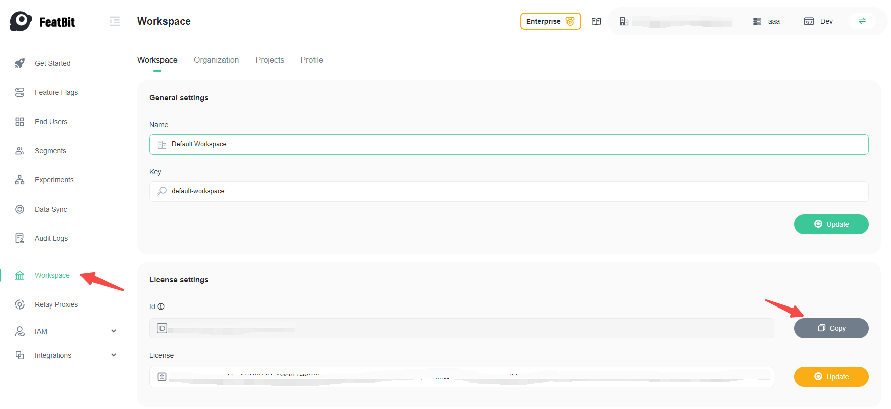
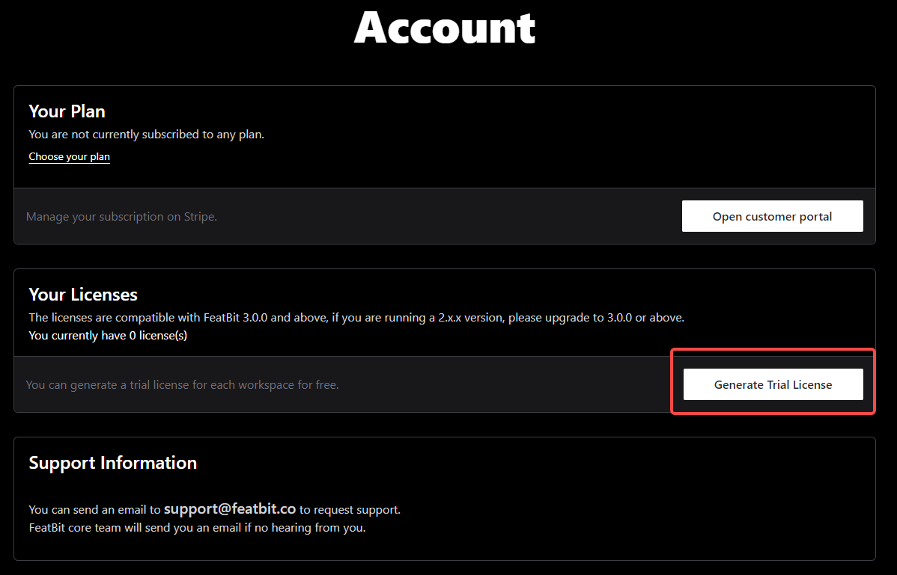
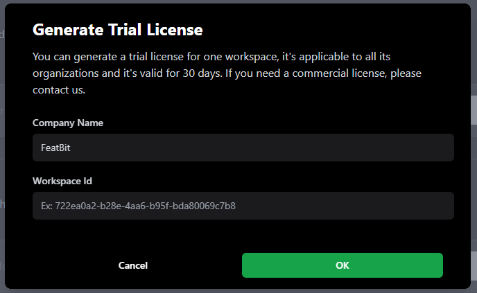
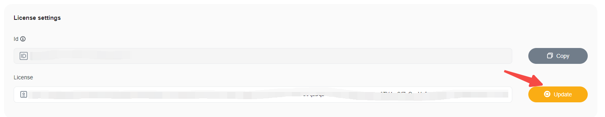
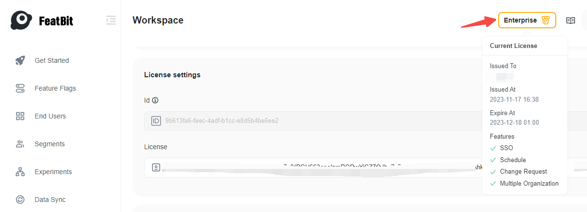

# Set up license key

This article will demonstrate how to set up FeatBit with a license key.

# Get workspace Id

You will need the workspace Id to request a license key, whether it's a trial license key or a commercial license key. 

1. Make sure your FeatBit is running, we assume the FeatBit UI is available at http://localhost:8081
2. Login into FeatBit with your email and password. If the default settings are used, you can use the default account: 
   - Username: test@featbit.com
   - Password: 123456
  
3. Go to http://localhost:8081/en/workspace, in the **License settings** section, click the **Copy** button
   
   

# Get a free trial license key

For the purpose of evaluating all features of FeatBit, you can generate a free trial license key from [FeatBit Dashboard](https://dashboard.featbit.co/account) by following the steps:

- Create an account with your Email or login by Github
- Click the **Generate Trial License** button in the **Account** page
  
  
- In the modal, input your Company Name and the Workspace Id then click on **OK**
  
  
- Find the license generated in the license table, and click the copy button
  
  

# Get a commercial license key

If a commercial license key is needed, please send an email to [contact@featbit.co](mailto:contact@featbit.co) or join our [Slack Channel](https://join.slack.com/t/featbit/shared_invite/zt-1ew5e2vbb-x6Apan1xZOaYMnFzqZkGNQ), we'll come back to you as soon as possible.

# Upload the license key

Now go back to http://localhost:8081/en/workspace, in the **License settings** section, put the license key from previous step and click on **Update**.

Onced saved, hover on the Enterprise button, you will be able to view the license details as following

