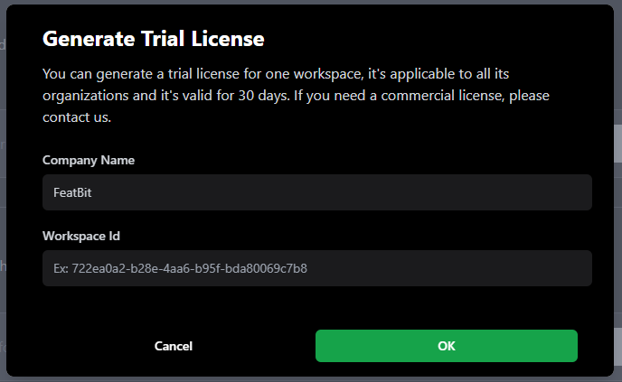
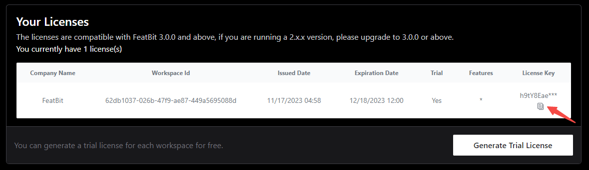

import {Callout} from 'nextra/components'

# Set up license key

<Callout type="info">
  This article is compatible with FeatBit 3.0.0 and above.
</Callout>

This guide illustrates the process of setting up FeatBit with a license key.

## Obtain Workspace ID

Before acquiring a license key, you need the workspace ID. Follow these steps:

1. Make sure your FeatBit is running, and we assume the FeatBit UI is available at http://localhost:8081
2. Log in to FeatBit using your email and password. For default settings, use:
   - Username: test@featbit.com
   - Password: 123456
  
3. Go to http://localhost:8081/en/workspace, in the **License Settings** section, click the **Copy** button
   
   

## Get a Free Trial License Key

To evaluate all FeatBit features, generate a free trial license key from the [FeatBit Dashboard](https://dashboard.featbit.co/account):

- Create an account using your email or log in via GitHub.
- Click **Generate Trial License** in the **Account** page.

  
- In the modal, input your Company Name and the Workspace ID, then click **OK**

  
- Locate the generated license in the license table and click Copy.

  

## Get a commercial license key

For a commercial license key, email [contact@featbit.co](mailto:contact@featbit.co) or join our [Slack Channel](https://join.slack.com/t/featbit/shared_invite/zt-1ew5e2vbb-x6Apan1xZOaYMnFzqZkGNQ), and we'll respond promptly.
## Upload the License Key

Now go back to http://localhost:8081/en/workspace, go to the **License Settings** section, input the license key obtained earlier, and click **Update**.

Once saved, hover over the Enterprise button, you will be able to view the license details as following

