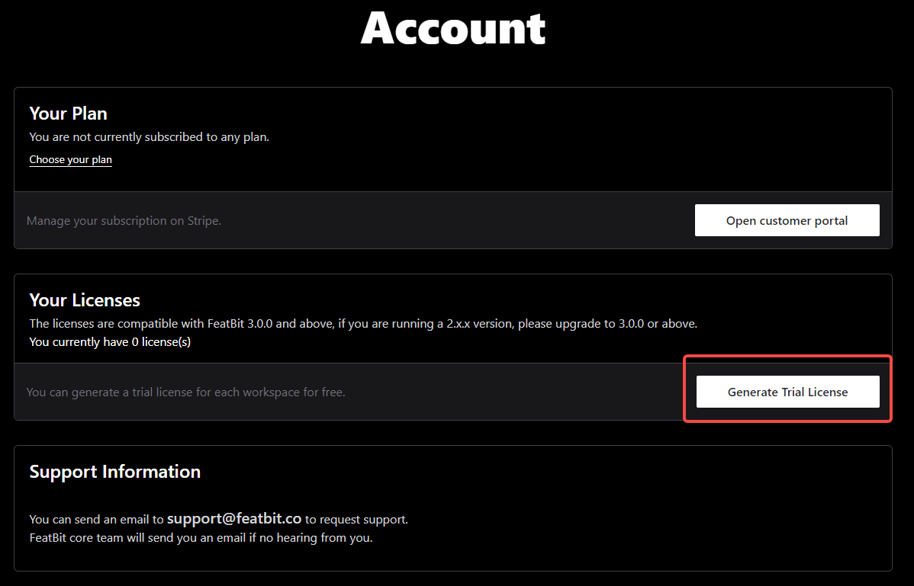

import {Callout} from 'nextra/components'

# Set up license key

<Callout type="info">
  This guide applies to FeatBit version 3.0.0 and above.
</Callout>

This guide walks you through the complete process of obtaining and configuring a license key for FeatBit, enabling access to enterprise features.

After that, you should be able to see the **License** details as the following screenshot:

## Step 1: Retrieve Your Workspace ID

Your workspace ID is required to generate a license key. Here's how to find it:

1. Navigate to the `Workspace` page in the FeatBit dashboard.
2. Click the `License` tab and you should be able to see your **Workspace ID**.
3. Click the **Copy Id** button to copy the ID to your clipboard.

## Step 2: Obtain Your License Key

Choose one of the following options based on your needs:

### Option A: Free Trial License (Recommended for Evaluation)

Perfect for testing all FeatBit enterprise features:

1. **Create Account**
  - Visit the [FeatBit Dashboard](https://dashboard.featbit.co/account)
  - Sign up with your email or authenticate via GitHub

2. **Generate Trial License**
  - Navigate to the **Account** page
  - Click **Generate Trial License**
   
  

3. **Provide Details**
  - Enter your **Company Name**
  - Paste your **Workspace ID** (from Step 1)
  - Click **OK**
   
  

4. **Copy License Key**
  - Find your generated license in the license table
  - Click **Copy** to copy the license key
   
  

### Option B: Commercial License

For production use and ongoing support, you can contact FeatBit team through either channel:

- **Email**: [contact@featbit.co](mailto:contact@featbit.co)
- **Slack**: Join our [Community Slack](https://join.slack.com/t/featbit/shared_invite/zt-1ew5e2vbb-x6Apan1xZOaYMnFzqZkGNQ)

We'll respond promptly with pricing and licensing information.

## Step 3: Apply Your License Key

Now that you have your license key, we can go back to the FeatBit dashboard to apply it:

1. Go to the `Workspace` page in the FeatBit dashboard.
2. Click the `License` tab.
3. Paste your license key into the **License** field.
4. Click the **Update** button to apply the license.

For additional support, reach out via our [Slack community](https://join.slack.com/t/featbit/shared_invite/zt-1ew5e2vbb-x6Apan1xZOaYMnFzqZkGNQ) or email [contact@featbit.co](mailto:contact@featbit.co).