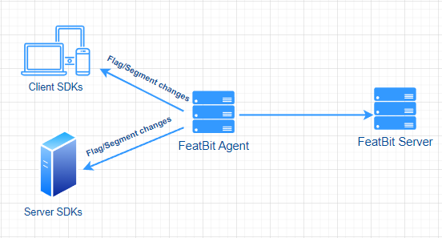
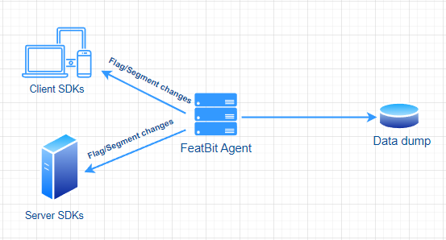

import { Callout } from 'nextra/components'

# FeatBit Agent

<Callout type="info">
This is a general introduction of FeatBit Agent, if you are looking for detailed instructions of installing FeatBit Agent, please refer to this [doc](https://github.com/featbit/featbit-agent#installation).
</Callout>

FeatBit Agent (the GitHub repo is [here](https://github.com/featbit/featbit-agent)) is a small program that sits between the FeatBit Server and your SDKs and providing both a cached read replica and a relay proxy of your FeatBit Server. This means you can scale up your FeatBit to serve tens of thousands of connected SDKs without increasing the load on your FeatBit Server.

FeatBit Agent provides four important features:

* **Performance**: FeatBit Agent caches the [feature flags](https://www.featbit.co) and segments in memory. A single FeatBit Agent instance running on a machine with minimal resources can support thousands of WebSocket connections, you can scale it up to support tens of thousands of WebSocket connections without duplicating FeatBit Server. &#x20;
* **Low latency**: The FeatBit Agent has the capability to run in close proximity to end users, resulting in a significant reduction in latency for users located far from the FeatBit Server.
* **Data Protection**: When you deploy FeatBit Agent on your customer's infrastructure, you can configure it to either not forward user usage data to the FeatBit Server and keep the data locally, or to perform data anonymization before sending it to the FeatBit Server. This ensures compliance with GDPR and other data protection laws, and promotes the protection of user data and privacy.
* **Resilience**: The FeatBit Agent is designed to survive restarts and operate properly even if you lose connection to your FeatBit Server.

## Concepts

FeatBit Agent supports two different modes:

* Agent: Connection to FeatBit Server, supports dynamic feature flags, segments and environment keys synchronization and other advanced features.
* Offline: No connection to FeatBit Server, full control of data and environment keys.

### Agent Mode

Agent is the default mode and should be used by default in most cases. It connects to the FeatBit Server and uses it as the source of truth for feature flags, segments and environment keys.

By default, Agent mode uses an in-memory cache to store the features it fetches from the FeatBit Server. However, you may want to use a more persistent storage solution. For this purpose, the FeatBit Agent supports a backup file (.db sqlite), which you can configure by passing in when starting the Agent. The FeatBit Agent will then check on startup to see if the persistent backup option is specified, in which case it will use it to populate its internal caches. This can be useful if your FeatBit server is unreachable.

For now, you can only use relay proxy and manually synchronize the feature flag configuration from the FeatBit server to the FeatBit Agent. Here’s the process:

1. Prepare a virtual machine that can be exposed to the internet with a public IP (or URL) to host the FeatBit Agent, ensuring it is accessible by the FeatBit service.
2. Create a relay proxy in the FeatBit portal and enter the FeatBit Agent endpoint created in the first step. Copy the Relay Proxy secret token. ([tutorial](https://docs.featbit.co/relay-proxy/relay-proxy#create-a-relay-proxy-configuration)).
3. Host the FeatBit Agent on the virtual machine created in the first step. ([tutorial](https://github.com/featbit/featbit-agent?tab=readme-ov-file#installation)).
4. Synchronize the feature flag configuration from the FeatBit server to the FeatBit Agent.

**NOTE**, we're developing a new version of the FeatBit Agent in collaboration with our customer, which will significantly enhance the user experience:

- No need to create a relay proxy and register FeatBit Agent in the FeatBit portal.
- No need to manually synchronize the feature flag configuration from the FeatBit server to the FeatBit Agent.
- And so on.

Check out this [GitHub issue](https://github.com/featbit/featbit/issues/665) for more details.

### Offline Mode

Offline mode should be used when you don't have a connection to the FeatBit Server. It can also be used when you need to have full control over both the data your clients receive and which environment keys can be used to access it.

Since this mode does not connect to a FeatBit Server, it requires a JSON dump of [feature flags](https://www.featbit.co), segments and environment keys. Here’s the process to get the dump file:

1. Prepare a virtual machine that can be exposed to the internet with a public IP (or URL) to host the FeatBit Agent, ensuring it is accessible by the FeatBit service.
2. Create a relay proxy in the FeatBit portal and enter the FeatBit Agent endpoint created in the first step. Copy the Relay Proxy secret token. ([tutorial](https://docs.featbit.co/relay-proxy/relay-proxy#create-a-relay-proxy-configuration)).
3. Host the FeatBit Agent on the virtual machine created in the first step. ([tutorial](https://github.com/featbit/featbit-agent?tab=readme-ov-file#installation)).
4. Synchronize the feature flag configuration from the FeatBit server to the FeatBit Agent.
5. The feature flag configuration (featbit.db) will be stored persistently in the FeatBit Agent directory.

Once the FeatBit Agent is restarted, it will load the feature flag configuration from the featbit.db file. You can also host additional FeatBit Agents and copy the featbit.db file to the root directory of each Agent. 