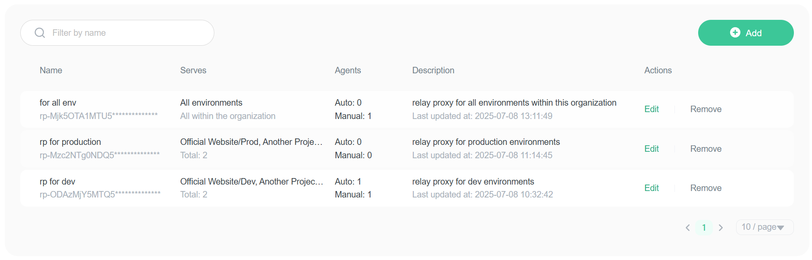
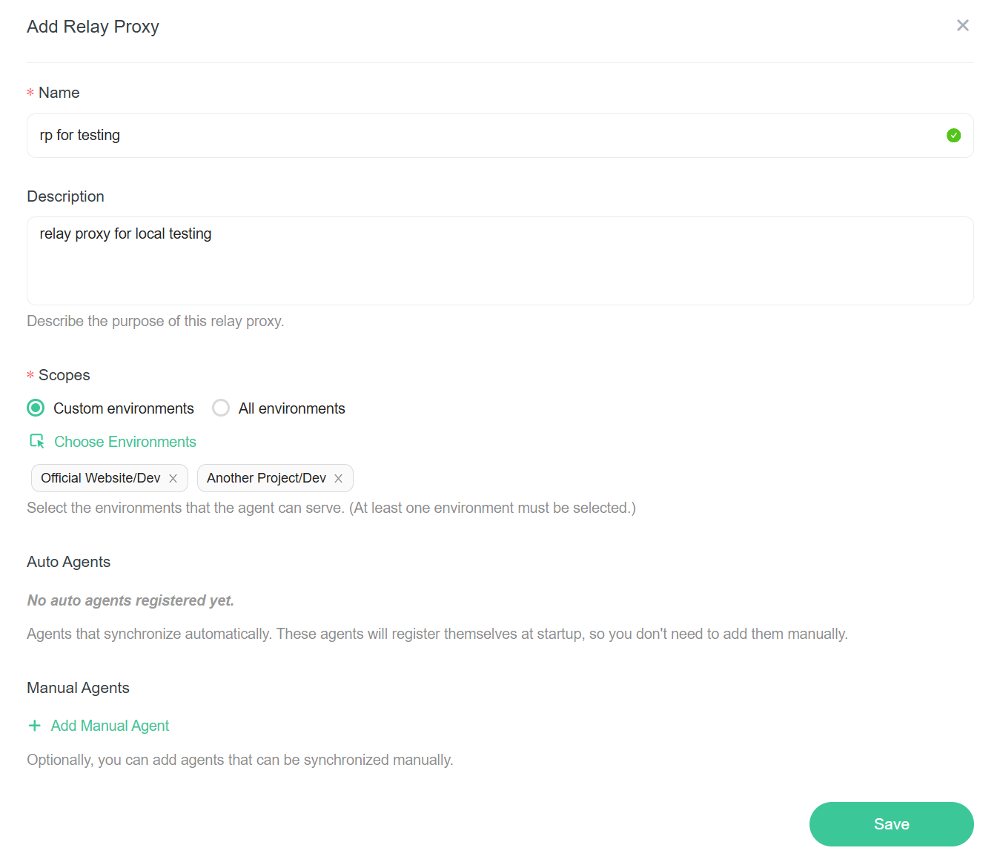
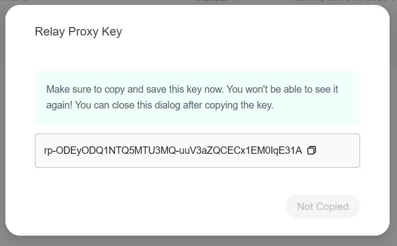
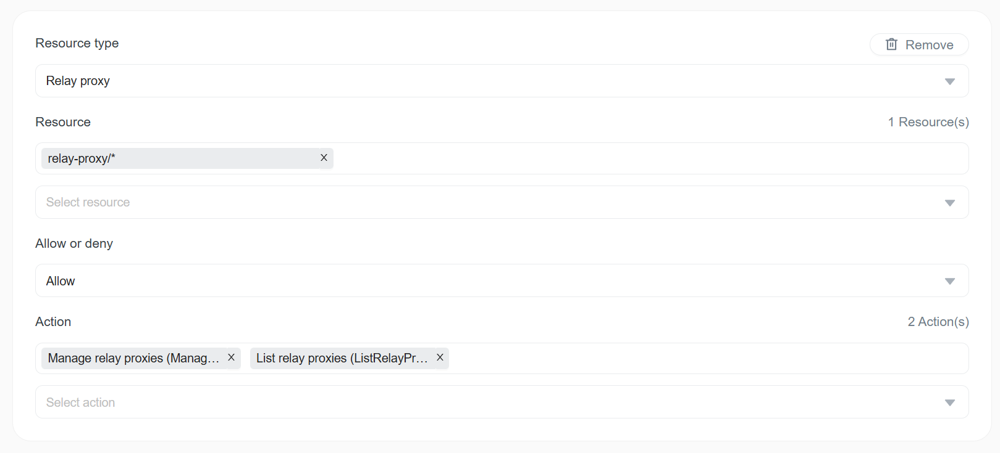

import { Callout } from 'nextra/components'

# Relay Proxy

The Relay Proxy is a management portal for [FeatBit Agents](https://github.com/featbit/featbit-agent) that allows you to monitor agent status and manage their configurations. 

## Understanding Agents

FeatBit supports two types of agents, each designed for different deployment scenarios:

### Auto Agents

Auto agents provide a seamless, zero-configuration experience with real-time capabilities:

**Key Features:**

- **Zero Configuration**: No manual setup required
- **Automatic Registration**: Self-register with the FeatBit platform upon startup
- **Real-time Synchronization**: WebSocket-powered instant data updates
- **Live Status Monitoring**: Continuous status reporting
- **SDK Events Forwarding**: Seamlessly forward SDK events to FeatBit platform

**Monitoring Capabilities:**

- Agent ID tracking
- Served environments
- Data synchronization status

### Manual Agents

Manual agents offer full control over agent lifecycle and configuration:

**Key Features:**

- **Manual Registration**: You need to register the agent manually
- **On-demand Synchronization**: Manually trigger data synchronization
- **Complete Lifecycle Management**: Create, edit, delete, and sync operations

**Monitoring Capabilities:**

- Availability status
- Served environments
- Last synced at

<Callout type="info">
  Status updates for manual agents occur only after performing manual sync operations.
</Callout>

## Relay Proxy Scope

The relay proxy scope determines which environments agents can serve. You can select one or more environments, and the agents will only be able to access the data from those environments.

<Callout type="warning">
  Scope changes don't automatically propagate to existing agents. To apply scope changes, for auto agents, simply restart the agent. For manual agents, you need to perform a manual sync.
</Callout>

## Create A Relay Proxy

To create a relay proxy:

1. Navigate to the **Relay Proxies** page in the FeatBit dashboard.
2. Click the **Add** button.
3. Enter a unique, descriptive name and a detailed description for the relay proxy.
4. Select the environments that this relay proxy can serve. You can choose one or more environments, or choose **All Environments** to allow the relay proxy to serve all environments within the current organization.
5. Optionally, you can add manual agents when creating the relay proxy.
6. Click the **Save** button.

After you create a relay proxy, a dialog will appear to show the ApiKey for this relay proxy. Make sure to copy and save it somewhere secure, as it will **not** be displayed again. You can close this dialog after copying the key.

## Permission Control

To be able to manage Relay Proxies, you must have the **ManageRelayProxies** and **ListRelayProxies** permissions, if you own one of the built-in policies (Owner, Administrator, Developer), you already have these permissions.

<Callout type="info">
  Users with only `ListRelayProxies` permission have read-only access to the Relay Proxies.
</Callout>

