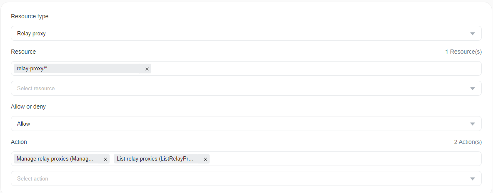
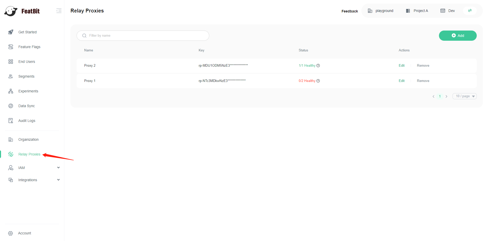
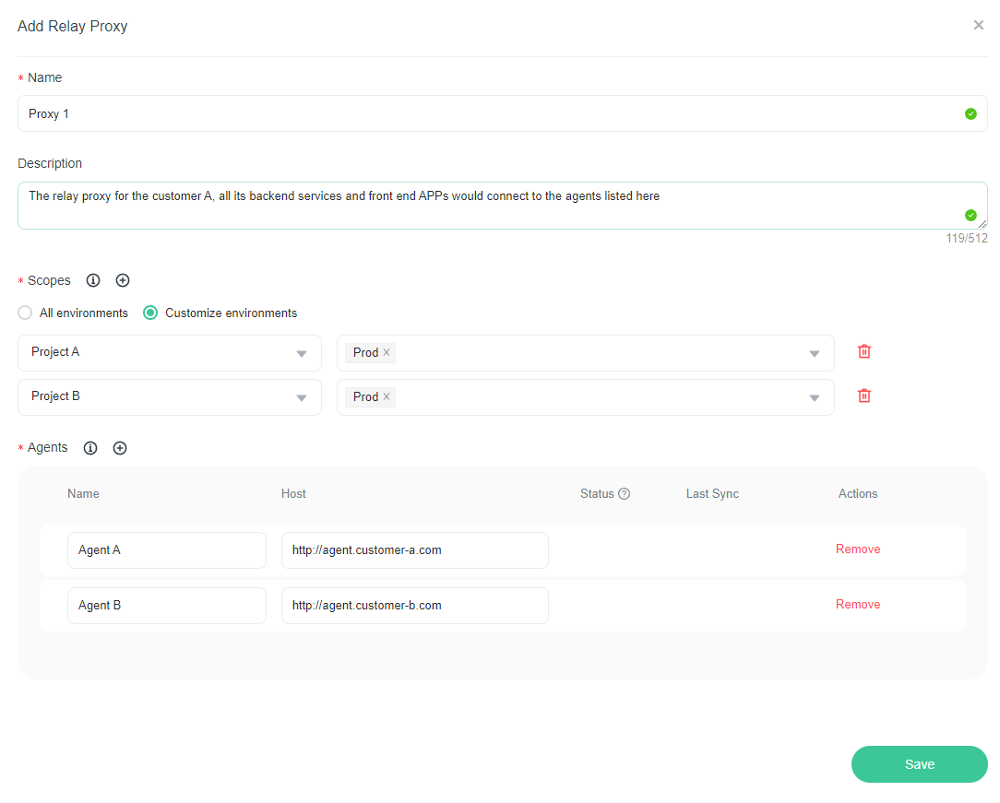
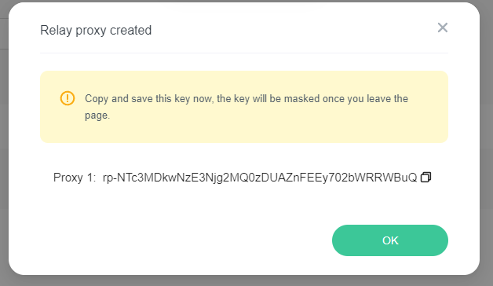
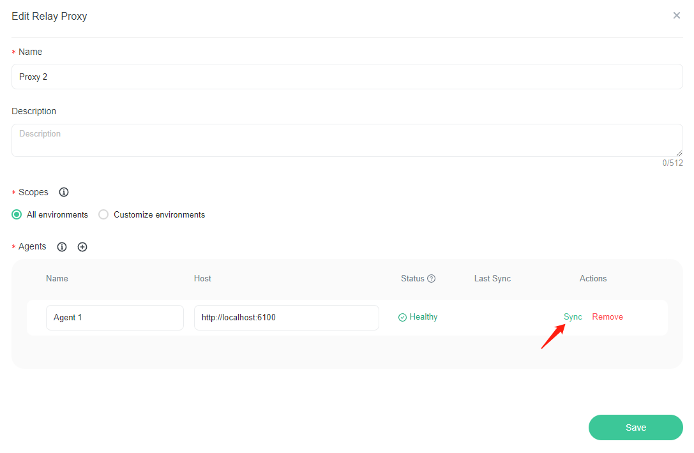
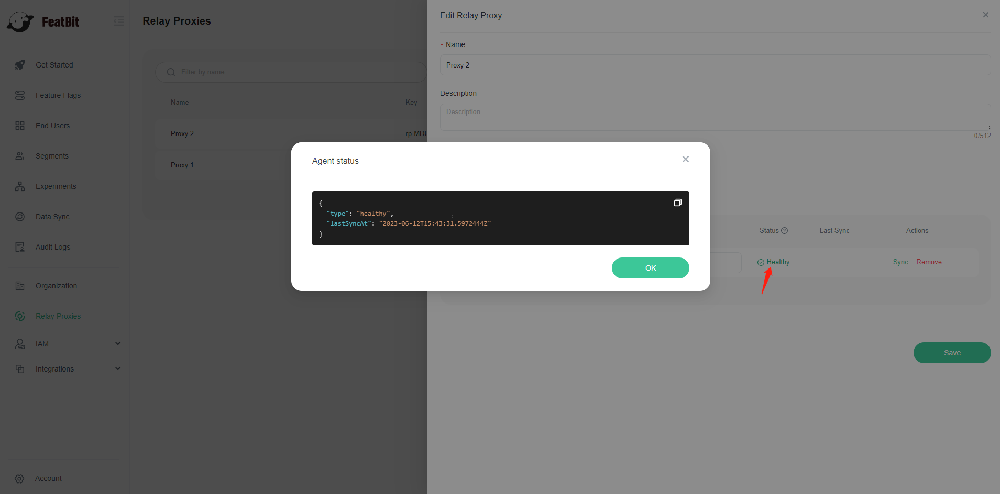
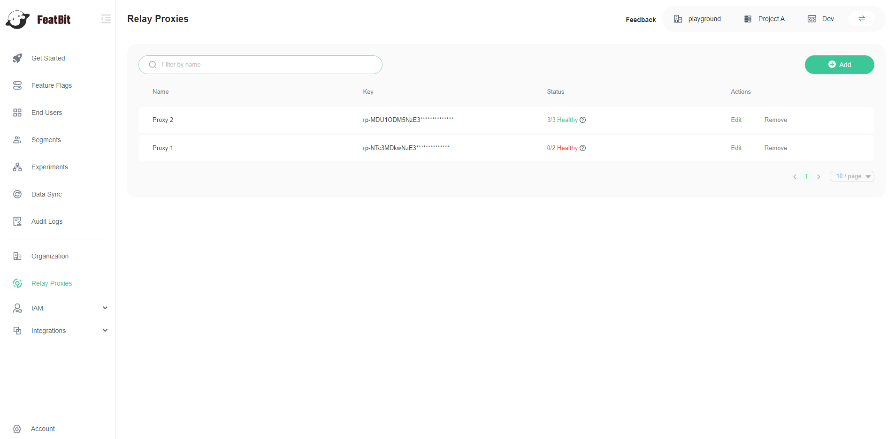

# Relay Proxy

## Overview 

This topic explains how to create a FeatBit Relay Proxy configuration, and how to connect the FeatBit Agent to it. If you don't know what a FeatBit Agent is, please read this [document](featbit-agent.md).

## Agent status

The FeatBit UI displays the following agent statuses

* Healthy: the agent is in a healthy state, everything is working properly
* Unhealthy: something is wrong with the agent
* Unreachable: the agent is not available. This is usually because the agent hasn't been started or the agent host URL is incorrect
* Unauthorized: if you see this, it means that the ApiKey you used to start the FeatBit Agent doesn't match with the relay proxy key

## Restricting who can create and manage relay proxies 

To be able to create a Relay Proxy Configurationn, you must have the **ManageRelayProxies** and **ListRelayProxies** permissions, if you own one of the built-in policies (Owner, Administrator, Developer), you already have these permissions.

## Create a relay proxy configuration

You can create an relay proxy configuration from the **Relay Proxies** page.

1.  Navigate to **Relay Proxy** page.

2.  Click on the **Add** button on the top right of the page, the **Add Relay Proxy** panel appears\

3. Give your token a human-readable **Name** and a description.
4. Set the scopes: select the environments from which you want to synchronize the feature flags and segments to the agents.
5. Set the agent names and hosts
6. Click **Save** button.
7.  Copy and save the key somewhere secure. After you leave this page, the key is obscured.

After you create a relay proxy, you can edit or remove it. You can also manage existing relay proxies from this page.

## Synchronize feature flags and segments to agents

Currently, we only support manual synchronisation. To do this, click on the Edit button of a relay proxy, then click on the Sync button in the Edit panel, then the feature flags and segments of the selected scopes would be synchronised to the agent.

## Check FeatBit Agent status

An agent can have different statuses. To update it or to debug if something is wrong, click on the status label and a modal with the agent's detailed status will appear. The **lastSyncAt** value is in UTC timezon.

## Manage relay proxies

To manage a relay proxy:

1. Navigate to the **Relay Proxies** page.
2. Find your proxy in the list.
3. Click the **edit** or **remove** button

You can check the status of the relay proxy:

* When all of its agents are in healthy state, the color is **green**
* If at least one of its agent is not in healthy state, the color is **red**

## Connect FeatBit Agent to FeatBit UI

After creating the relay proxy configuration, you should have the key saved somewhere, use that key as the ApiKey parameter value to start FeatBit Agent, please read [Install FeatBit Agent](https://github.com/featbit/featbit-agent#installation).
