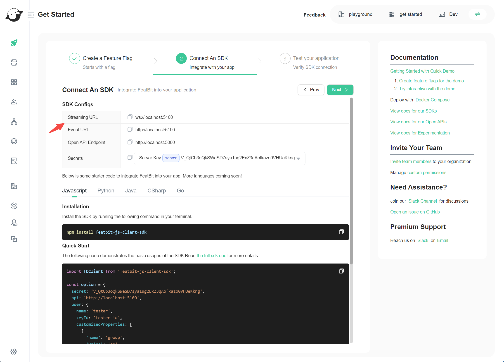

# FAQ

## How to get the environment secret

### Get the current environment secret

Hover on the environment icon in the top right corner on any page and click to copy the secret wanted.

### Get the secret of other project environment

1. Go to the page **organizations/projects**
2. Find the project and then the environment you want
3.  Copy one of the secrets according to your SDK type (server side or client side)\

## How to get the SDK URLs

1. Go to **Get Started** page
2. Create a feature flag or select an existing one and click on next
3.  On the SDK Configs section of the page, you will find the **Streaming URL** and **Event URL**. In most cases, both URLs will be the same and correspond to the evaluation server URL.

