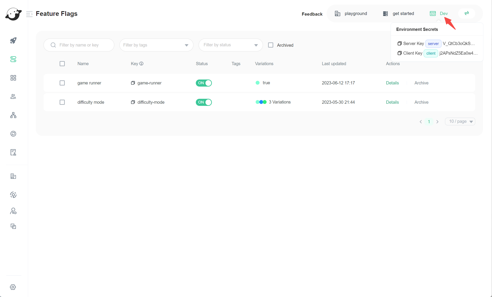
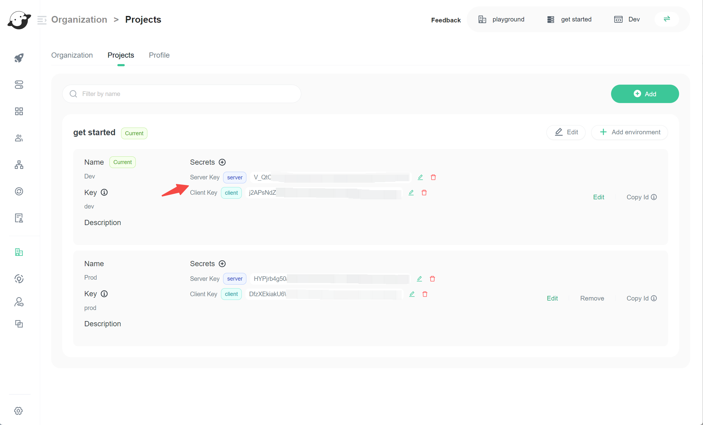
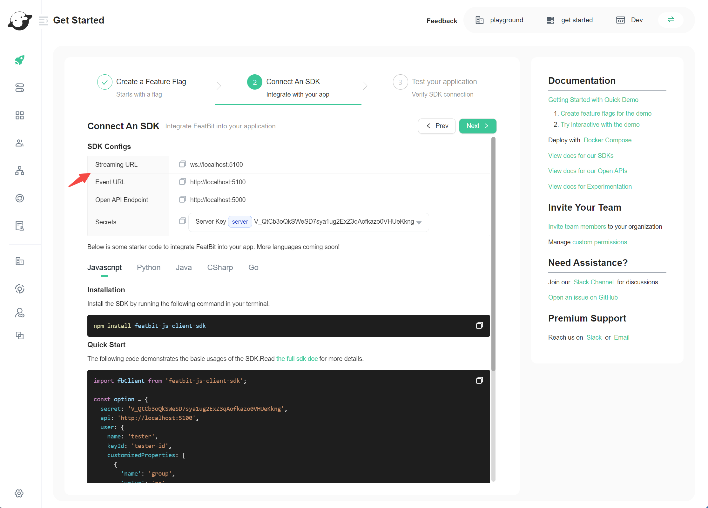

import { Callout } from "nextra/components";

# FAQ

## How to get the environment secret

### Get the current environment secret

1. Locate the environment icon in the top right corner of any page.
2. Hover over the icon, then click to copy the secret for your environment.

### Get the secret of other project environment

1. Navigate to **Organizations/Projects**.
2. Find the project and select the environment you need.
3. Copy the secret that matches your SDK type:
   - **Server-Side SDK**: Use the server secret.
   - **Client-Side SDK**: Use the client secret.

<Callout type="info">
  **Tip:** Keep your environment secrets safe. Never share them in public.
</Callout>

## How to get the SDK URLs

1. Go to the **Get Started** page.
2. Create a feature flag, or select an existing one and click **Next**.
3. In the **SDK Configs** section, you will see:
   - **Streaming URL** (`wss://...`): Used for real-time updates.
   - **Event URL** (`https://...`): Used for sending events.
     Both usually point to the [Evaluation Server Service (ELS)](../tech-stack/application-services#evaluation-server-service-els).

<Callout type="info">
  **Note:** If you have custom infrastructure (e.g., have another ELS
  service deployed and designate it as the dedicated event server), the event URL
  may differ, check with your administrator if unsure.
</Callout>

