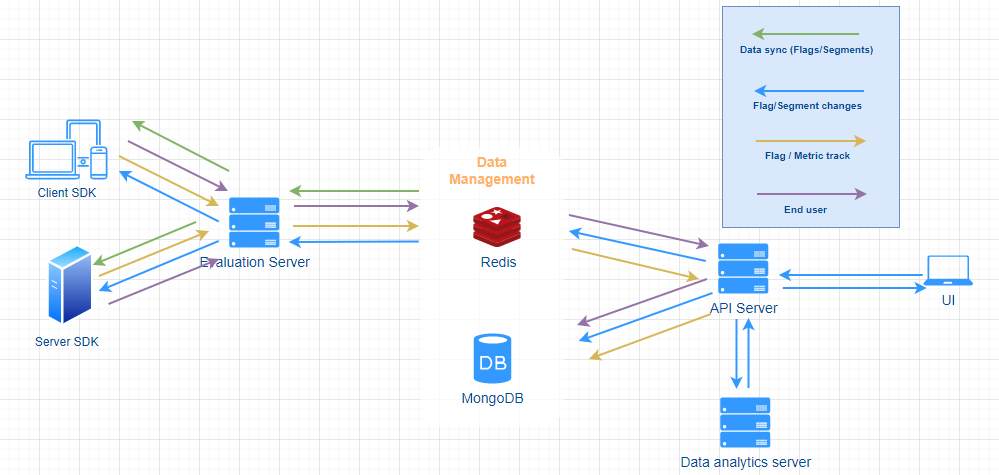
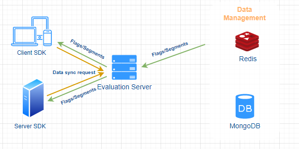
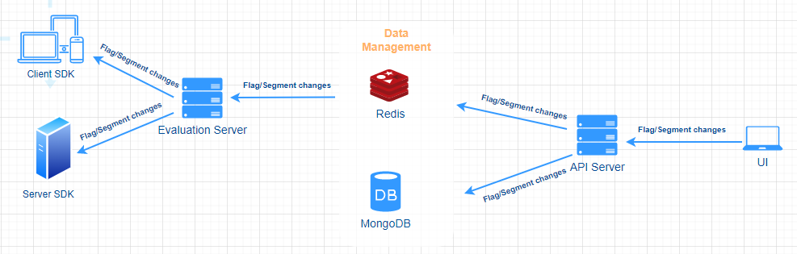
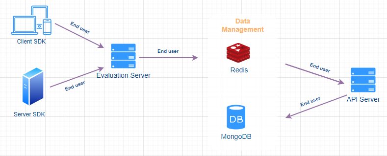
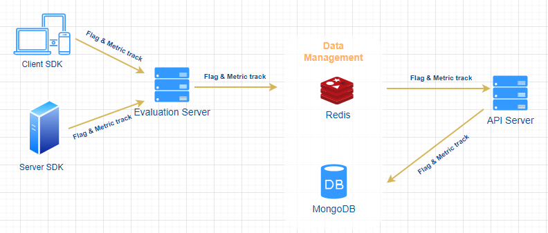

import { Callout } from 'nextra/components'

# Architecture

<Callout type="info" >
  This document is intended for the standard version, please refer to [Architechture - Professional](architecture-professional.md)for the professional version instead. For the differences between standard and professional versions, please check [Standard VS. Professional](standard-vs.-professional.md).
</Callout>

## **Overview**

FeatBit is a **scalable** and **fast** Feature Management platform. The mission of FeatBit is to empower all teams to deliver, control, experiment with, and monetize their software.

The overall architecture is as follows:

* **UI :** Provides users a visual UI interface for managing and publishing feature flags, segments and experiments etc.
* **API Server :** Provides data management capabilities for the UI and external integration services, such as flag triggers, code-references etc.
* **Evaluation Server :** Provides a scalable and high-performance flag rule evaluation engine and a data distribution server.
* **Data Analytics server :** Provides a data analytics engine. It assures the following services
  * Calculates the experiments and return its results in near real time.
  * Provides insights services for all analytics in the UI, the feature flag reporting for example.
* **SDK:** We provide SDKs for all major languages and frameworks, providing quick access to FeatBit from your services and applications.
* **Redis :** It has two roles
  * The cache layer to boost the performance.
  * The message queue assuring high throughput asynchronous data communications among different services.
* **MongoDB :** The main database. All feature flags, segments, experiments, end users and analytics data are stored in MongoDB.

## Scalable and high performance

When designing the architecture, our most important and the only concerns were how to make it scalable and how to obtain the best performance possible. To do so, we carefully selected our tech stack and containerized all services, which makes it very easy to be deployed as a cluster and **scale horizontally**.

As for the data storage and data flow between services, in order to obtain the best performance possible, we introduced MongoDB as our main data store, Redis as system cache and message queue. We are using **Multiplexing** and **Pub & Sub system** to send/receive messages between services, the average reaction time is in milliseconds.

The push of feature flag changes or other configurations to SDKs is near real time. It takes less than **100** milliseconds to push the data to SDKs when a flag is changed from the UI. Instead of long polling, the WebSocket solution is adopted as it can proactively push the changes to SDKs once it happens. Of course, this is not cost free, it can consume enormous memory when huge number of concurrent requests happen. To avoid being a memory monster, we have carefully selected the way to serialize and deserialize data, so it doesn't consume extra memory during the serialization and deserialization process.

## Data flows

When the system is running, data flows between different services. There are four main data flows:

### Data sync (feature flags / Segments) data flow

The feature flag / Segment data is stored in MongoDB, it is the most important data store and serves for all major features of FeatBit.

After a connection has been established between a client or server SDK and evaluation server, the SDK would send a data sync request attached with the timestamp of the latest changes to evaluation server, evaluation server will check that timestamp and fetch eligible feature flags and segments from Redis, after an eventual evaluation process (only for client SDK), the result would be sent back to SDK. The response has one of the two types:

* **full**: the response contains all feature flags and segments
* **patch**: the response contains only the new feature flags and segments created or updated since the timestamp

### Feature flag / Segment changes data flow

When a user changes a feature flag or a segment from the UI, in addition to store data in MongoDB, the API server also pushes the changes to Kafka, Evaluation server reads those changes, update Redis, evaluate feature flags related to the changes and sends related feature flags or evaluation results to client/server side SDK through WebSocket connections.

### End user data flow

End user data is stored in MongoDB and serves for feature flag and segment targeting.

When client SDK establishes a WebSocket connection or switches to another user (by calling the identify API), or client/server SDK sends track message,  Evaluation server sends end user information to Kafka, then API server reads that data and update/insert into MongoDB.

### Feature flag and metric track data flow

Feature flag and metric track data is stored in ClickHouse and serves for A/B/n testing (experimentation) and reporting.

When client/server SDK sends feature flag and metric track messages to Evaluation server, the latter forwards the track messages to Kafka, Data analytics servers reads track messages from Kafka and stores them in ClickHouse.

## **You are the only owner of all your data**

The overall architecture also ensures privacy aspects since all the data and communication stays within the system. It will not send any data to any third party service.
