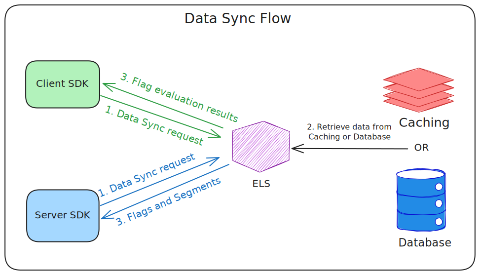
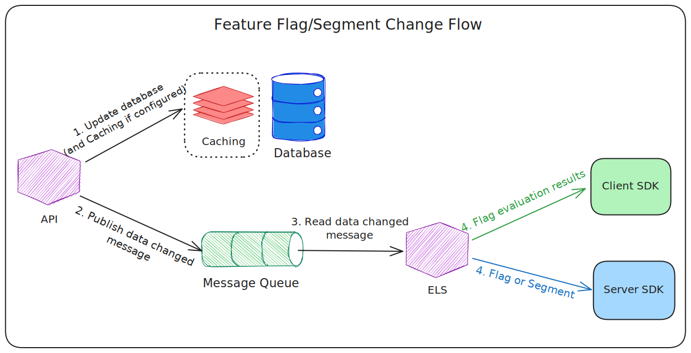
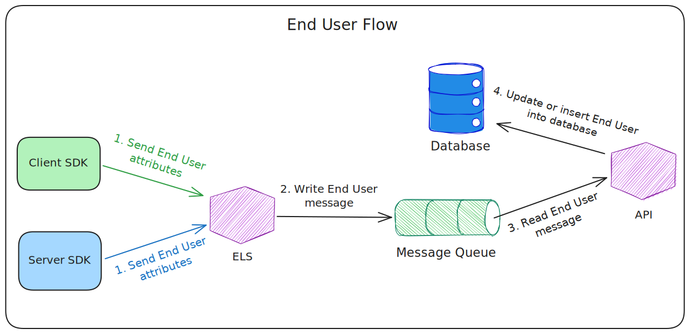
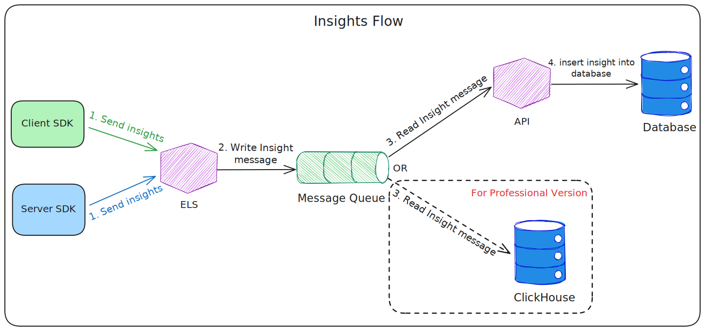

# Data Flows

When the system is running, data flows between different services. There are four main data flows:

### Data sync flow

After a websocket connection has been established between a client or server SDK and ELS, the SDK would then send a data
sync request attached with the timestamp of the latest changes to ELS, ELS will then check that timestamp and fetch
eligible feature flags and segments from Caching/Database component, after an eventual evaluation process (
only for client SDK), the result would be sent back to SDK. The response has one of the two types:

* **full**: the response contains all feature flags and segments
* **patch**: the response contains only the new feature flags and segments created or updated since the timestamp

### Feature flag / Segment changes flow

When a user changes a feature flag or a segment from the UI, in addition to update data in Database, the API server also
pushes the changes to Message Queue, ELS reads those changes, evaluate feature flags related to the
changes and then sends related feature flags or evaluation results to client/server side SDK through WebSocket
connections.

### End user data flow

End users can be used in feature flag and segment targeting.

When client SDK establishes a WebSocket connection or switches to another user (by calling the identify API), or
client/server SDK sends insights message, ELS sends end user information to Message Queue, then API server reads that
data and update/insert into Database.

### Insights data flow

Insights data contains

- feature flag evaluation result: for feature flag reporting
- experiment metric track data: for A/B/n testing (experimentation)

For professional version, there is a dedicated Analytics database (Clickhouse) that is not the same as the Primary
database. For the other two versions, the Primary database is used for both.

When client/server SDK sends insights data to ELS, the latter forwards the track
messages to Message Queue, then in

- Standalone and Standard version: API server reads the data and updates/inserts into MongoDB
- Professional version: Clickhouse consume the data from Kafka

