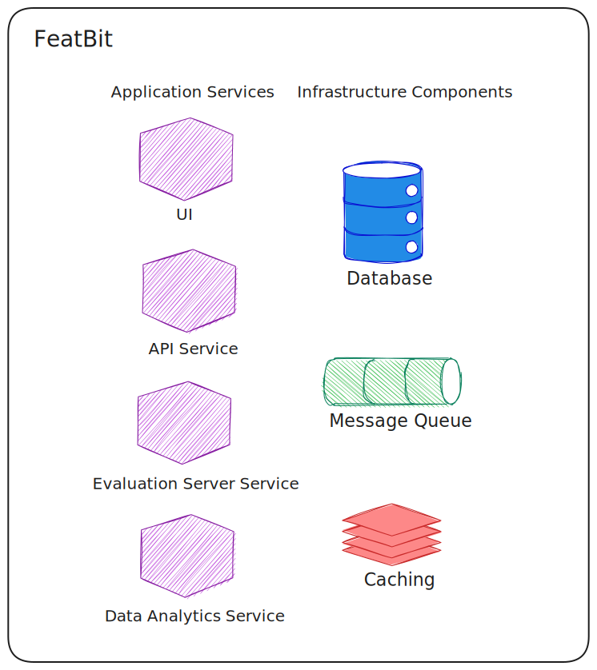

# Overview

FeatBit is a **scalable**, **fast**, and **lightweight** feature management platform designed for businesses of all
sizes. It provides robust feature flag management with real-time updates and comprehensive analytics capabilities.

## Scalability, Performance and Privacy

When designing the architecture, our most important and the only concerns were how to make it scalable and how to obtain
the best performance possible. To do so, we carefully selected our tech stack and containerized all services, which
makes it very easy to be deployed as a cluster and **scale horizontally**.

The push of feature flag changes or segment changes to SDKs is near real time. It takes less than **100ms** to push the
data to SDKs when a flag is changed from the UI. Instead of long polling, the **WebSocket** solution is adopted as it can
proactively push the changes to SDKs once it happens. Of course, this is not cost free, it can consume enormous memory
when huge number of concurrent requests happen. To avoid being a memory monster, we have carefully selected the way to
serialize and deserialize data, so it doesn't consume extra memory during the serialization and deserialization process.

The overall architecture also ensures privacy aspects since all the data and communication stays within the system. It
will not send any data to any third party service.